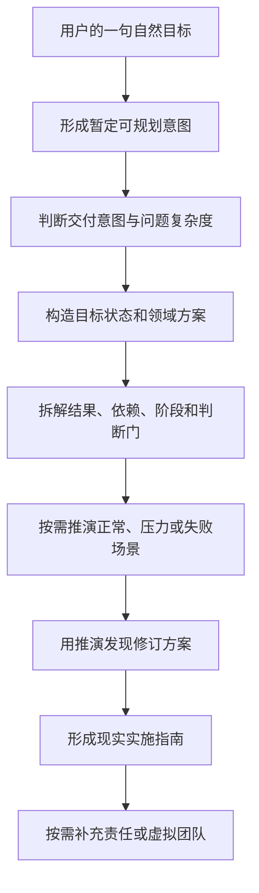

# 目标实现推演

`goal-orchestrator` 面向“知道自己想实现什么，但还没有完整路径”的用户。用户不需要先说明要技术方案、实施方案还是组织设计；一句“我要……”“我想……”或“我的目标是……”就足够启动意图理解、目标规划和必要的情景推演。

英文 Skill 标识保持为 `goal-orchestrator`，可以继续使用 `$goal-orchestrator` 显式调用，也应能被真实自然目标表达触发。

## 核心定位

本 Skill 先把简单描述构造成可规划意图：现实变化、对象或受益者、成功信号、边界、关键未知和最小可逆假设。随后才判断用户需要哪种交付：

- 明确要产品、技术、业务或组织方案：方案为主，实施从轻，默认没有虚拟团队。
- 只给出一个目标：形成实质方案、目标规划、代表性情景推演和实施路径。
- 已经确定方案：尊重既定基线，重点编排拆分、依赖、责任、验收、发布和回退。

能用条件和可逆假设继续时，先给完整版本，再把高杠杆问题放在结尾。只有未知会导致完全不同路线或重大不可逆风险时，才先问一个问题。



## 五种深度独立判断

`solution_depth`、`planning_depth`、`simulation_depth`、`implementation_depth` 和 `organization_depth` 分开选择。

- 方案深度关注领域设计是否足以理解和评审。
- 规划深度关注目标是否有指南价值。
- 推演深度关注需要多少代表性场景暴露缺口。
- 实施深度关注阶段、依赖、验收和回退需要展开多少。
- 组织深度关注是否需要责任映射或跨专业模拟协作。

短输入不等于简单目标。管理 2000 人、多业务单元或组织变革通常需要深入规划和结构化场景推演；三个月学会游泳可以用自然、渐进的轻量计划，不必项目化。

## 推演不依赖虚拟团队

这里有三个不同概念：

1. 目标中的真实组织，例如事业部、业务单元和管理层级。
2. 真实组织或目标路径的运行情景推演，例如战略变化、连续不达标、重大客诉和核心干部离职。
3. 用于生成和审查方案的虚拟团队。

前两者是规划内容，可以在没有虚拟团队时深入展开。只有第三者使用完整团队协议和唯一 `R0`。这使 Skill 能恢复真正的目标推演，同时保留按需组织原则。

## 输出应有什么价值

目标规划按相关性包含：

- 暂定的可规划目标和重要假设。
- 目标状态、运行机制或具体方案。
- 关键结果、依赖和候选路径。
- 阶段成果及继续、调整、回退或停止的判断门。
- 代表性情景、暴露缺口和由此产生的具体修订。
- 现实验证信号和现在可以启动的第一步。

这些是信息价值要求，不是固定标题。简单目标不会被膨胀；复杂目标也不会被压缩成“明确目标、拆解任务、持续复盘”几句口号。

## 保留的边界

- 普通“给我一份方案”仍按标准深度交付；明确要求简要时，短答仍保留推荐、适用边界和关键验证门。
- Electron 与 Tauri 等运行型比较仍要求候选轴与平台轴分离；需要双原型时，两个候选在相同条件下完成可比切片后才能最终决策。
- 完整虚拟团队首次自然标识唯一 `R0`；关键成果的独立验证者不同于设计者和实现者，`R0` 不兼任独立验证。
- Skill 不把方案推演写成已经发生的现实测试、部署、反馈、收益或批准。

## 使用示例

一句目标：

```text
我要管理 2000 人的事业部。
```

明确方案：

```text
给我一份 2000 人事业部组织架构方案，不要实施计划。
```

聚焦场景：

```text
推演一下重大客诉横跨销售、交付和产品时的决策链。
```

既有方案实施：

```text
技术方案已经确定为 React Native、Supabase 和 Stripe，请给两名开发者十二周落地计划。
```

## 文件结构

```text
goal-orchestrator/
├── SKILL.md
├── README.md
├── agents/openai.yaml
├── assets/orchestration-report-template.md
├── evals/
│   ├── evals.json
│   └── trigger-evals.json
├── references/
│   ├── examples.md
│   ├── goal-planning-protocol.md
│   ├── output-contracts.md
│   ├── role-schema.md
│   ├── role.schema.json
│   └── simulation-protocol.md
└── scripts/check_consistency.py
```

## 验证

在 Skill 目录运行：

```text
python3 scripts/check_consistency.py .
```

发布前再运行 Skill Creator 的 `quick_validate.py`，并执行行为回归和不带显式 Skill 名的触发回归。
