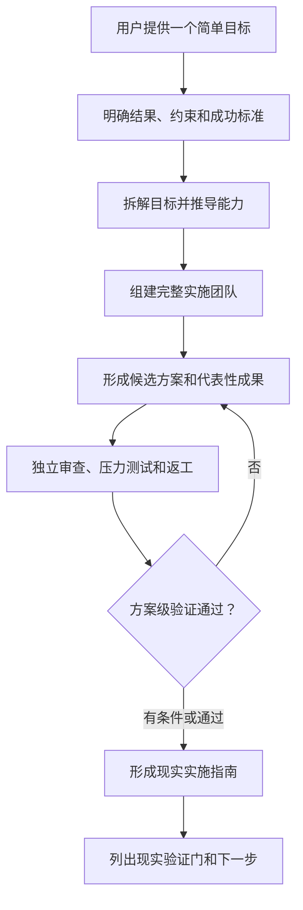

# 目标实现推演

> 把一个简单目标转化为经过模拟验证、可用于现实执行的方案。

`goal-orchestrator` 面向“知道自己想实现什么，但不知道具体怎样做”的用户。它会分析目标、补充必要假设、拆解结果、推导能力、组建完整专业团队，通过模拟协作生成并审查方案，最后交付一份可以指导后续现实实施的指南。

英文 Skill 标识继续保留为 `goal-orchestrator`，原有 `$goal-orchestrator` 调用方式不会失效。

## 它怎样工作



核心关系是：

- **模拟是方法：** 专业角色形成方案、代表性成果、审查意见和修订记录。
- **可行性验证是质量门：** 检查逻辑、依赖、资源、接口、运营、风险和测试设计。
- **实施指南是交付物：** 给出阶段、负责人、前置条件、行动、产出、验收门和备用路径。
- **现实执行是后续流程：** 编译、设备测试、用户验证、部署、交易、发布等都没有发生。

## 可行性结论

Skill 不会为了迎合目标而强行宣布“可行”。它会给出以下一种结论：

- **方案级可行：** 在现有事实和假设下没有已知方案阻碍，但仍需完成现实验证。
- **有条件可行：** 路径成立，但依赖明确的资源、数据、批准、测试或其他前提。
- **暂不具备可行性：** 存在阻断性问题，需要调整范围、路径或前置条件。

这里的“经过验证”指方案级验证，不等于现实成功已经得到证明。

## 完整团队仍然不可缺少

不执行现实动作，不代表可以删除现实中负责执行的人。

开发应用时仍应包括产品、设计、开发、测试、整合、发布和维护职责；写书时仍应包括作者和编辑；运营门店时仍应包括现场运营和测量负责人。角色使用正常专业名称，不反复添加“虚拟”前缀。

生产角色会形成足以审查方案的实现蓝图、接口、伪代码、内容样本、操作规程或测试设计；验证角色可以发现问题、驳回并要求修改。但这些成果不会被描述为已经完成的现实产品。

## 输出方式

默认分为两层：

- **用户层：** 目标理解、推荐路径、可行性结论、Mermaid 流程图、完整团队、关键审查发现、现实实施指南和下一步。
- **结构层：** 目标、子目标、能力、角色、交付物、事件、证据状态、覆盖关系、可行性评估、实施阶段和现实验证项。默认隐藏或放在附录中。

流程、交接和返工必须使用 Mermaid。表格只用于少量静态比较、精确映射或结构化附录。

## 使用

最简单的调用只需要一个目标：

```text
$goal-orchestrator 我的目标是创建一个 RAW 编辑应用。
```

也可以补充约束：

```text
$goal-orchestrator 我的目标是创建一个 RAW 编辑应用；只开发 macOS，主要支持索尼、尼康和富士。
```

Skill 应自行完成目标分析、能力推导、完整组队、方案生成、协作模拟、方案级验证和实施指南汇总，不要求用户先理解专业术语或项目管理。

## 现实边界

每次结果只需在开头清楚说明一次：

> 以下方案通过模拟协作和方案级验证形成，可作为现实实施指南；尚未执行任何现实操作，标注的现实验证事项仍需完成。

禁止浏览实时资料、联系人员、操作账户、消费资金、修改外部系统、真实开发或部署，以及把模拟检查描述为真实测试、反馈、收益、指标或进度。

## 结构化数据

结构化输出保留：

```yaml
schema_version: "3.0"
positioning_zh: "目标实现推演"
execution_mode: simulation
simulation_only: true
deliverable_type: implementation_guide
external_actions_performed: []
feasibility_assessment: {}
implementation_guide: {}
reality_checks_required: []
```

用户可以要求以 JSON 或 YAML 输出完整追溯记录。

## 文件结构

```text
goal-orchestrator/
├── SKILL.md
├── README.md
├── agents/openai.yaml
├── assets/orchestration-report-template.md
├── references/
│   ├── examples.md
│   ├── output-contracts.md
│   ├── role-schema.md
│   ├── role.schema.json
│   ├── sample-role.json
│   └── simulation-protocol.md
└── scripts/check_consistency.py
```

## 一致性检查

在 Skill 目录中运行：

```text
python3 scripts/check_consistency.py .
```

发布前还应运行 Skill Creator 的 `quick_validate.py`。
