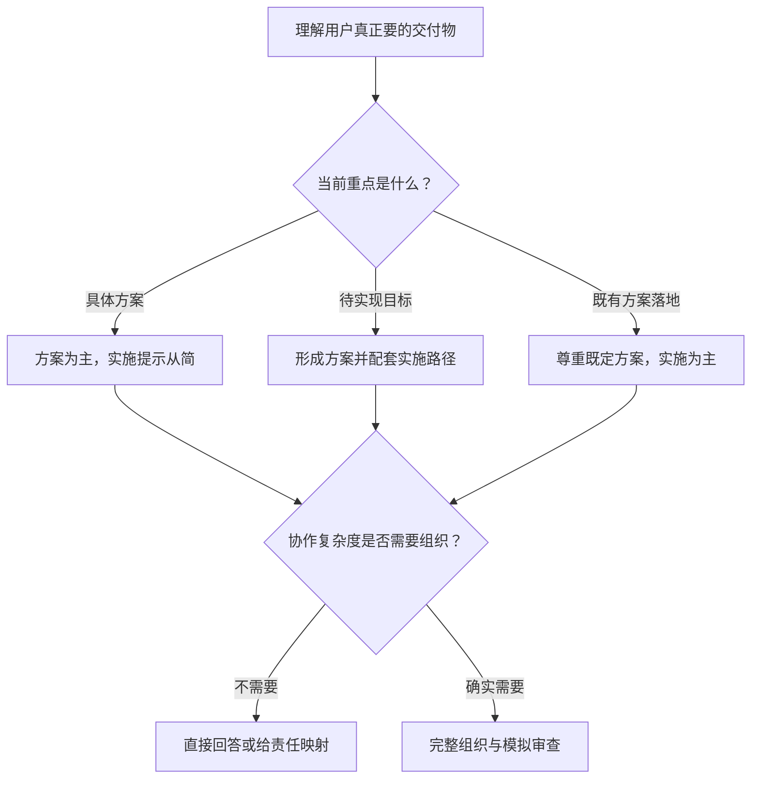

# 目标实现推演

`goal-orchestrator` 先判断用户真正想得到什么，再自然地交付与用途和复杂度匹配的方案、目标实现路径或既有方案的实施编排。它不会因为请求里出现“方案”“应用”或“目标”就机械套用团队、流程图和固定报告，也不会把不组织化误解为只给几句建议。

英文 Skill 标识保持为 `goal-orchestrator`，继续使用 `$goal-orchestrator` 调用。

## 新定位

同一句“我要做一款应用”，可能意味着不同交付物：

- 用户明确要技术方案、产品方案、业务方案或架构比较时，重点给出方案本身，实施提示从简，默认不创建组织。
- 用户只给出一个想实现的目标时，先形成有实质内容的方案，再给出与复杂度匹配的实施路径。
- 用户已经确定方案或技术栈并要求落地时，尊重已有决定，把重点放在拆分、依赖、责任、验收和交付。

方案深度、实施深度和组织深度分别判断。明确索要“方案”时默认交付可讨论、可决策的标准深度方案；只有明确要求概要、快速建议或一页结论才压缩。用户明确要求详细、完整、可落地或评审级方案，或问题本身复杂高风险时，会进入深入方案：在推荐、边界、模块、流程、取舍、异常、风险和验证之外，按实际需要说明接口、数据模型、状态、安全、性能、兼容、运维或验收。

Skill 会独立判断组织深度。简单请求不展示角色；需要多人责任时只给责任映射；只有复杂协作、跨领域交接、独立验证、高风险或用户明确要求时，才构建完整模拟团队并使用 `R0` 协调者。



请求类型、方案深度和组织深度是独立判断。技术方案不应自动产生虚拟团队；目标实现也不必自动组队，例如“三个月学会游泳”更适合直接给训练方案和实施节奏。没有团队、Mermaid 或完整实施计划，不意味着方案可以退化成摘要。

## 自然输出

默认行为是：

- 先给用户要的答案，再解释依据。
- 使用与问题相符的标题和篇幅，不展示内部路由标签。
- 不固定输出团队、可行性标签、Mermaid、评审历史、现实检查和结构化附录。
- 不用组织架构或流程套话代替具体的产品、技术或业务方案。
- 删除无信息价值的形式，但保留支撑理解、判断、评审和后续设计的领域机制、边界、取舍和验证。

对于标准技术方案，常见输出是推荐与边界、模块职责、数据或控制流、选型取舍、不适用条件、异常与风险、验证标准，以及按需的轻量实施提示。对于目标实现，常见输出是产品或方法方案、阶段路径、必要责任和关键验证。对于既有方案落地，常见输出是实施基线、工作拆分、依赖、质量门、发布和回退。

这些是内容参考，不是强制章节顺序。

## 组织何时出现

组织深度有三档：

- `none`：直接给方案或步骤。
- `responsibility_map`：只说明必要责任、交付和验收，不创建完整角色档案。
- `simulated_team`：生成能力驱动的完整组织，由生产者、验证者、整合者和交付责任共同形成并审查实施方案。

只有第三档创建唯一的 `R0`。完整角色对象沿用 `schema_version: "3.0"` 的角色契约；根结构化输出在需要时使用 `schema_version: "3.2"`，并将方案状态、方案深度、实施深度和组织深度分开记录。

## 真实性边界

Skill 可以分析、设计、比较、计算、生成代表性成果和进行方案审查，但不会把这些写成已经发生的现实开发、测试、部署、市场反馈、收益或批准。

边界说明按需出现，不再作为每个答案的固定开场。使用模拟团队、用户要求了现实执行但本次没有执行，或方案审查容易被误解为现实证据时，才需要简短说明。

## 使用示例

明确索要方案：

```text
$goal-orchestrator 给我一份本地优先笔记应用的技术方案，重点说明同步和冲突处理。
```

只给出目标：

```text
$goal-orchestrator 我想做一款面向自由摄影师的 RAW 编辑应用。
```

实施既有方案：

```text
$goal-orchestrator 架构已经确定为 React Native 和 Supabase，请给我十二周落地计划。
```

明确要求组织推演：

```text
$goal-orchestrator 请组建完整团队，推演这款医疗随访产品的方案、风险和实施路径。
```

## 文件结构

```text
goal-orchestrator/
├── SKILL.md
├── README.md
├── agents/openai.yaml
├── assets/orchestration-report-template.md
├── evals/evals.json
├── references/
│   ├── examples.md
│   ├── output-contracts.md
│   ├── role-schema.md
│   ├── role.schema.json
│   ├── sample-role.json
│   └── simulation-protocol.md
└── scripts/check_consistency.py
```

## 验证

在 Skill 目录运行：

```text
python3 scripts/check_consistency.py .
```

发布前再运行 Skill Creator 的 `quick_validate.py`，并用 `evals/evals.json` 做行为级回归，重点观察意图理解、标准方案是否避免短答、深入方案是否保持机制完整度、组织适配和自然表达。
