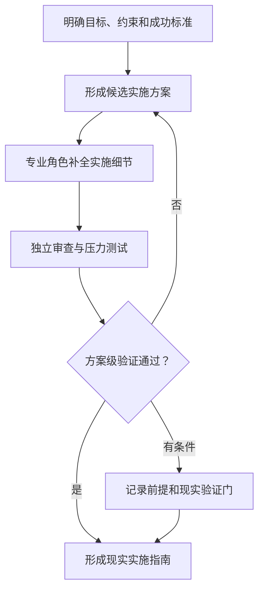
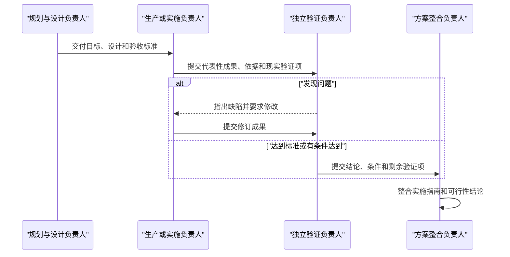

# 目标实现推演

> 把一个简单目标转化为经过模拟验证、可用于现实执行的方案。

以下方案通过模拟协作和方案级验证形成，可作为现实实施指南；尚未执行任何现实操作，标注的现实验证事项仍需完成。

## 我理解的目标

{{用普通用户能理解的语言复述目标，不使用内部编号。}}

- **希望得到的现实结果：** {{可观察结果及受益者}}
- **已经确定：** {{用户明确提供的事实、约束和资源}}
- **暂时按此处理：** {{最少且可逆的关键假设}}
- **完成的判断标准：** {{现实中怎样才算完成}}

## 先给结论

### 推荐路径

{{用两三句话给出首选实现路径及最关键的取舍。}}

### 可行性结论

**{{方案级可行 / 有条件可行 / 暂不具备可行性}}。**

{{说明方案级验证覆盖了什么、结论成立的条件、已知阻碍，以及为什么不能把它理解为现实成功证明。}}

## 这件事怎样落地



{{根据当前目标替换为真实适用的阶段、并行关系和决策点。用一小段话解释最重要的实施路径。}}

## 需要哪些专业角色

### {{负责理解目标或用户需求的角色}}

{{说明这个角色为用户解决什么问题、负责什么现实职责、向方案交付什么。}}

### {{负责设计的角色}}

{{说明其责任、关键决定和与实施角色的交接。}}

### {{负责生产或实施的角色}}

{{说明该角色在现实中会实施什么，并在本次推演中形成哪些可审查的蓝图、样本、接口、规程或测试准备。不能只写“提供建议”。}}

### {{负责独立验证的角色}}

{{说明验收标准、方案层可以检查什么、哪些现实测试仍未进行，以及何时有权驳回。}}

### {{负责整合、交付、运行或学习的角色}}

{{按目标实际需要拆分或合并，但所有适用阶段都必须有责任人。}}

### 目标实现协调者

{{说明它只负责组织、交接、质量门、返工和汇总，不代替任何专业角色。}}

## 方案怎样经过审查



- **形成的主要成果：** {{使方案具体且可审查的工作产品}}
- **发现的关键问题：** {{审查或压力测试发现}}
- **发生的返工：** {{谁退回了什么、为什么、怎样修改}}
- **最终接受的内容：** {{接受或有条件接受的结果}}
- **仍然阻塞的内容：** {{若无则说明没有已知方案级阻碍}}

只说明改变了推荐路径、可行性结论或实施指南的重要事件，不写冗长角色对话。

## 现实实施指南

### 阶段一：{{阶段名称}}

- **负责人：** {{现实责任角色}}
- **开始前需要：** {{前置条件和输入}}
- **建议行动：** {{未来应执行的动作；不得写成已经发生}}
- **应得到的成果：** {{可验收输出}}
- **进入下一阶段的条件：** {{质量门或停止条件}}

### 阶段二：{{阶段名称}}

- **负责人：** {{现实责任角色}}
- **开始前需要：** {{前置条件和输入}}
- **建议行动：** {{未来应执行的动作}}
- **应得到的成果：** {{可验收输出}}
- **进入下一阶段的条件：** {{质量门或停止条件}}

{{按目标增加必要阶段。包含交付、运行和反馈时，不要停在设计或开发。}}

### 风险和备用路径

- **{{风险}}：** {{触发条件、影响、负责人、缓解方式和停止条件}}
- **备用路径：** {{首选路径失败或前提不成立时怎样调整}}

## 必须在现实中验证

### {{现实验证问题}}

- **为什么重要：** {{它影响哪些结论或阶段}}
- **怎样验证：** {{数据、样本、环境、测试或试点方法}}
- **通过标准：** {{可观察阈值}}
- **不通过时：** {{返工、降级、换路或停止}}

{{列出真正开始前或实施过程中必须取得的现实证据。}}

## 你现在需要决定

1. {{最影响方案方向或可行性的用户选择}}
2. {{仅在确实需要时添加第二项}}
3. {{仅在确实需要时添加第三项}}

{{如果无需再决定，改为列出一至三项现实第一步。}}

## 结构化附录（可选）

只在用户要求、专业交接或审计确有价值时保留本节。否则删除。

### 目标、能力、角色和指南追溯

| 内部对象 | 关联关系 | 状态或缺口 |
|---|---|---|
| {{子目标 ID}} | {{能力 ID → 角色 ID → 交付物 ID → 实施阶段}} | {{覆盖、条件接受或阻塞}} |

### 结构化契约

```yaml
schema_version: "3.0"
positioning_zh: "目标实现推演"
tagline_zh: "把一个简单目标转化为经过模拟验证、可用于现实执行的方案"
execution_mode: simulation
simulation_only: true
deliverable_type: implementation_guide
external_actions_performed: []
feasibility_assessment:
  status: "<plan-viable | conditionally-viable | not-yet-viable>"
  scope: "plan-level"
implementation_guide: {}
reality_checks_required: []
```
