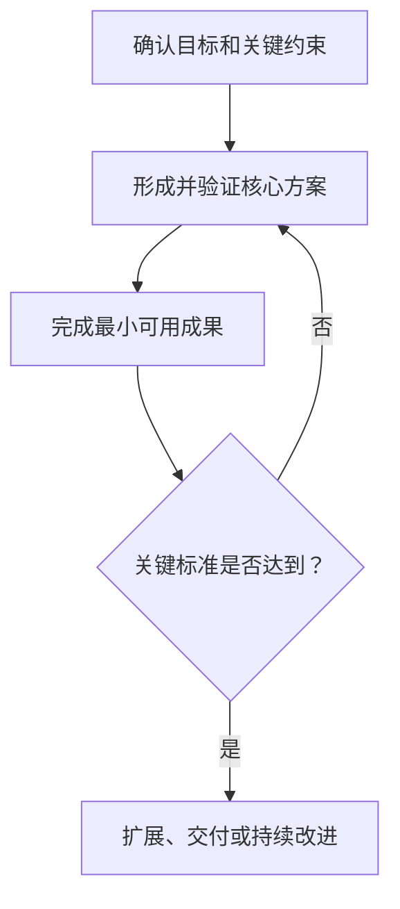
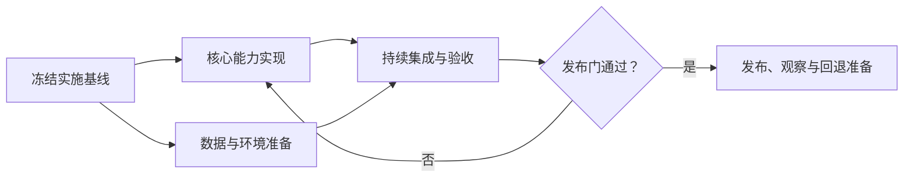
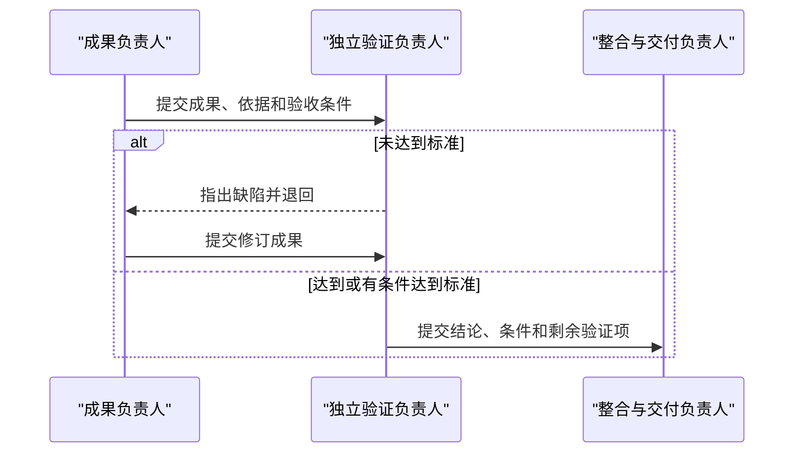

# 目标实现推演：模块化报告模板

本模板用于用户明确要求独立报告、专业交接文档或审计材料时。它是模块库，不是固定大纲：先理解用户的交付意图，再选用必要模块；删除所有无关模块、说明文字和占位符。

不要把内部的 `solution_design`、`goal_realization`、`implementation_orchestration`、`concise`、`standard`、`deep`、`none`、`responsibility_map` 或 `simulated_team` 标签显示在成品中。

普通“给我一份方案”按 `standard` 深度使用方案模块；它不是短答模板。只有用户明确要求概要、快速建议或一页结论时才采用 `concise`。`deep` 方案在标准模块之外按相关性加入契约、模型、状态和非功能约束。实施和组织模块从轻时，保留方案模块的领域细节。

`concise` 不是把方案削成口号：用最少篇幅保留推荐与关键机制或理由、一个适用边界或升级条件和一个关键验证门。它们可以写成自然段落，不必为了完整感添加固定标题、数字、完整数据模型、接口或排期。

## 所有报告都需要的开头

```markdown
# {{贴合用户问题的自然标题}}

{{第一段直接给出推荐方案、核心结论或实施重点。不要先解释内部流程。}}

{{仅列出会改变结论的用户事实、关键假设或范围边界；若无需说明则删除。}}
```

## 方案模块

用户明确索要技术、产品、业务或其他具体方案时，以本模块为主体。不要自动添加团队模块。

```markdown
## {{推荐方案或核心设计}}

{{给出领域具体的推荐、范围边界、核心模块及职责，以及数据、控制或业务流程怎样运作。标准方案不能只列方向或名词。}}

## {{关键取舍}}

{{比较真正影响选择的方案，说明推荐依据、代价和不适用条件。没有实质替代方案时，改为说明关键约束或边界。}}

{{若差异取决于运行表现、兼容性或体验，让两种候选在同一代表性真实数据集、同一目标设备或系统、同一任务和预算下做短期原型。候选轴是两种要比较的方案；平台轴只是两者共同覆盖的环境，不能替代候选对照。}}

{{逐项列出候选 A 与候选 B 各自完成同一端到端任务；两种候选都在最终选型前完成最小可比垂直切片，并在两者结果齐备后才应用阈值。只验证推荐候选、把另一候选推迟到失败后，不算双候选对照。}}

{{预先写清可判定的度量及保持或切换阈值。用户未给数值时使用待填预算变量或硬门（如 `T_start`、`M_max`），不编造数字：当前候选全部硬门通过则保持；只有当前候选至少一项硬门失败、另一候选在相同条件下通过且没有新增关键兼容或维护阻碍时才切换。未真实完成双候选对照时，只能给基于现有信息的初步或倾向性推荐，不得写成已经证实的最终选型；若双原型成本不成比例，也说明后续证据门。纯成本、政策或合规比较改用相应证据和决策门，不强加双原型。}}

## {{风险与验证}}

{{说明会影响方案成立的失败或异常路径、风险、验证方法和通过或切换条件。}}

### 实施提示

{{仅在 implementation_depth 为 light 或 detailed 时保留：写会影响架构或方案决策的先后顺序、原型和验证门。没有实施模块不能成为缩短方案主体的理由。}}
```

### 深入方案扩展模块（按需）

用户明确要求详细、完整、可落地、评审级或交付级方案，或问题本身复杂、高风险、跨系统时，在标准方案模块后选择相关内容。不要为了凑齐栏目照搬全部项目。

```markdown
## {{接口与数据契约}}

{{说明重要对象、字段、版本、读写边界、接口输入输出和失败语义。}}

## {{状态、一致性与异常恢复}}

{{说明关键状态、转换条件、并发或重试语义、冲突处理和恢复策略。}}

## {{非功能约束与验收门}}

{{按相关性说明安全与隐私、性能与容量、兼容性、可观测性、运行方式，以及可验证的验收标准。}}
```

## 目标实现模块

用户只给出目标时，先在这里形成实质方案，再接实施模块。不能用目标拆解或团队名单代替解决方案。

```markdown
## {{建议把目标做成什么}}

{{说明受益者、价值、范围、核心做法和关键取舍。}}

## {{实现路径}}

{{给出与复杂度匹配的阶段、依赖、阶段成果和验收条件。简单目标可以用自然步骤。}}
```

当路径具有三步以上依赖、并行汇合或决策分支，且图比短列表更清楚时，可替换为目标相关 Mermaid：



## 既有方案实施模块

用户已有方案时，以本模块为主体。先记录不可改变的基线，不重做已完成的选型。

```markdown
## {{实施基线}}

{{简洁列出已经确定的方案、约束和交付目标。}}

## {{落地计划}}

### {{阶段名称}}

- 前置条件：{{输入和依赖}}
- 主要工作：{{未来要做的具体动作}}
- 责任：{{仅在多人协作确有必要时写}}
- 阶段成果：{{可验收输出}}
- 通过条件：{{质量门、停止条件或回退条件}}

{{按需增加阶段，不为追求统一格式重复空字段。}}
```

复杂依赖或多人交接适合用 Mermaid；普通两三步计划直接列出即可。



## 责任映射模块（按需）

仅在多类责任和交接确实影响实施时加入。描述责任、交付和验收，不生成角色档案或 `R0`。

```markdown
## {{责任与交接}}

- {{责任名称}}：负责 {{具体工作}}，向 {{下游责任}} 交付 {{成果}}，以 {{标准}} 验收。
- {{责任名称}}：负责 {{具体工作}}，在 {{条件}} 下接手，并对 {{结果}} 负责。
```

## 完整模拟组织模块（严格按需）

只有复杂协作、跨领域交接、独立验证、高风险或用户明确要求团队推演时加入本模块，并先应用角色和模拟协议。方案仍应出现在团队之前。

```markdown
> 以下组织协作与审查属于方案推演，尚未执行现实开发、测试或发布；相关结论仍需按文中的验证条件确认。

## {{实施所需的协作结构}}

### {{领域生产或实施责任}}

{{说明它为方案产生什么具体成果、交给谁、以什么标准验收。}}

### {{独立验证责任}}

{{说明检查对象、预先确定的标准、驳回权和仍需现实验证的内容。关键成果的验证者不同于其设计者和实现者，也不是协调者。}}

### {{整合、交付、运行或反馈责任}}

{{只保留目标实际需要的责任。}}

### {{协调角色的正常专业职称}}（R0，唯一）

{{首次出现时明确这是唯一协调者；只负责路由、质量门、返工和汇总，不代替领域生产者，也不担任独立验证者。后文直接使用领域自然职称，不必反复展示编号或机械列角色表。}}
```

只有审查真的改变建议时，才加入：

```markdown
## {{方案为何调整}}

{{用一小段说明发现了什么问题、哪部分被退回、如何修改，以及这怎样改变了推荐或实施门槛。不要写角色对话。}}
```

交接和返工复杂时，可以使用：



## 条件、风险与下一步模块

只选择用户当前需要的内容：

```markdown
## {{关键风险或成立条件}}

- {{风险或条件}}：{{影响、触发信号、缓解或回退方式。}}

## {{开始前必须验证的事项}}

- {{问题}}：用 {{方法}} 验证；达到 {{标准}} 才进入 {{阶段}}，否则 {{失败路线}}。

## {{现在最值得做的事}}

1. {{最高杠杆的决定或第一步}}
2. {{确有价值时再增加}}
```

普通方案不必添加正式可行性标签。用户要求可行性判断或复杂实施需要方案级质量门时，可写“方案级可行”“有条件可行”或“暂不具备可行性”，并紧接着说明依据、条件和现实未知。

## 结构化附录（可选）

仅在用户要求、系统交接或审计需要时添加。根对象采用 3.2；完整角色对象继续采用 3.0。

```yaml
schema_version: "3.2"
request_mode: "<solution_design | goal_realization | implementation_orchestration>"
solution_status: "<to_design | partially_defined | fixed>"
solution_depth: "<concise | standard | deep>"
implementation_depth: "<none | light | detailed>"
organization_depth: "<none | responsibility_map | simulated_team>"
deliverable_type: "<solution | solution_and_implementation | implementation_plan>"
external_actions_performed: []
solution: {}
implementation: {}
evidence: {}
simulation: null
```

如果存在完整组织，`simulation` 记录 `execution_mode: simulation`、审查事件和角色；每个角色保持 `schema_version: "3.0"`。
