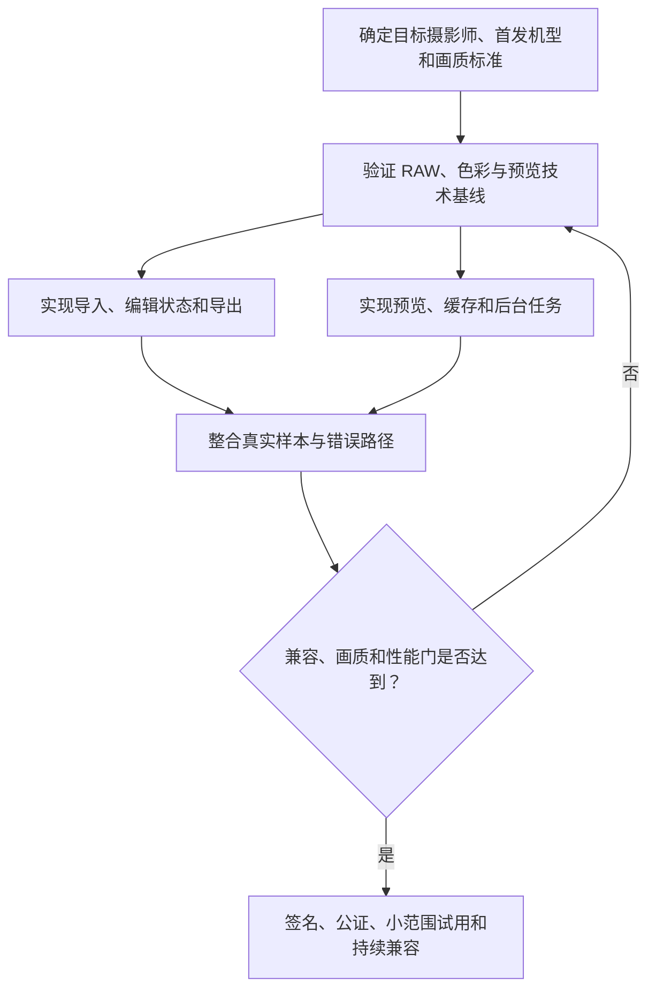

# 自适应路由示例

这些示例用于校准意图判断、内容比例和自然表达，不是可以复制的固定模板。重点观察：用户真正要什么、方案是否有实质、实施是否过度、组织是否必要，以及哪些模块应该省略。

## 目录

1. [触发边界](#触发边界)
2. [示例一：明确的技术方案](#示例一明确的技术方案)
3. [示例二：只有产品目标](#示例二只有产品目标)
4. [示例三：既有方案的实施](#示例三既有方案的实施)
5. [示例四：简单个人目标](#示例四简单个人目标)
6. [示例五：明确要求团队推演](#示例五明确要求团队推演)
7. [示例六：架构比较](#示例六架构比较)
8. [示例七：同题的深度梯度](#示例七同题的深度梯度)
9. [共同规律](#共同规律)

## 触发边界

适合使用本 Skill 的请求包括：

- “`$goal-orchestrator` 给我一份离线优先笔记应用的技术方案。”
- “我想做一款面向自由摄影师的 RAW 编辑应用，但不知道从哪里开始。”
- “架构已经确定，请给我十二周落地计划。”
- “请组建完整团队推演这个高风险产品的方案和实施。”

调用 Skill 不等于要求完整团队。普通的短事实回答、单步代码修改或已经有明确执行工具且只要求直接执行的任务，不应被改写成一份组织推演报告。

## 示例一：明确的技术方案

**用户请求：** 给我一份本地优先的跨平台笔记应用技术方案，重点说明同步和冲突处理。

**内部判断：** 这是明确的方案设计；方案深度为 `standard`，实施从轻，组织深度为 `none`。

**合适的回答形态：**

开头直接推荐“本地数据库作为权威读写层、操作日志驱动增量同步、服务端负责中继与设备游标、字段级冲突合并配合不可自动合并时的副本保留”。主体应具体说明：

- 本地数据模型、变更日志、设备标识、逻辑时钟和同步游标。
- 离线写入、增量上传、远端拉取、幂等应用和删除墓碑的流程。
- 标题、标签等字段可采用末次写入或集合合并；正文可采用操作变换、无冲突复制数据类型，或更务实的段落级版本合并，并解释复杂度取舍。
- 端到端加密会怎样限制服务端合并和全文检索。
- 原型期应先验证多设备离线编辑、重复投递、时钟偏差和大文档合并。

实施只需补充两三个验证顺序，不需要“产品经理、架构师、开发、测试、运营、目标实现协调者”的团队名单，也不需要固定边界声明、正式可行性标签或整份现实实施指南。

**不合适：** 第一屏介绍虚拟团队，方案只剩“设计同步能力”和“建立质量门”。

## 示例二：只有产品目标

**用户请求：** 我想做一款面向自由摄影师的 macOS RAW 编辑应用，主要支持 Sony、Nikon 和 Fujifilm，但不知道该从哪里开始。

**内部判断：** 用户给出目标而非既定方案，需要实质产品与技术方案，加上详细实施路径。RAW、色彩、性能、兼容、发布和持续维护存在跨域交接及独立验证需要，可以使用 `simulated_team`，但团队仍放在方案之后。

**合适的开头：**

建议首版聚焦“导入文件夹、非破坏基础调整、实时预览、批量导出”这一条完整摄影流程，把图库管理、人工智能修图和插件系统后置。技术上采用原始文件只读、编辑参数单独保存、统一线性色彩空间、中间预览缓存和后台导出队列；相机适配围绕具体机型样本建立兼容矩阵，而不是笼统声称支持三个品牌。

接着说明产品边界、核心模块、RAW 与色彩管线、错误处理和性能预算，再给实施路径：

随后才简洁介绍真正必要的产品与摄影工作流、RAW 与色彩、macOS 开发、渲染性能、独立质量与兼容验证、发布维护以及 `R0` 协调责任。用一次边界说明，呈现一项真正改变方案的审查，例如质量负责人退回了缺少损坏文件、未知机型和长任务取消处理的蓝图。

正式结论可以是“有条件可行”：方案层可以闭环，但真实 RAW 样本的色彩、内存、延迟、稳定性、签名和公证仍须现实验证。

**不合适：** 只给阶段和团队，没有说清楚产品做什么、数据如何保存、RAW 怎样处理或首版为何如此取舍。

## 示例三：既有方案的实施

**用户请求：** 技术方案已经确定为 React Native、Supabase 和 Stripe，不要重新选型。请给两名开发者一份十二周的会员应用落地计划。

**内部判断：** 既有方案实施；方案被固定，实施详细。两名开发者需要明确责任和交接，但没有足够理由展开完整模拟团队，可用 `responsibility_map`。

**合适的回答形态：**

先确认基线：保留 React Native、Supabase 和 Stripe，目标是在十二周内交付可验证的注册登录、会员订阅、权益状态、内容访问和发布能力。随后按依赖排期：

1. 第一至二周冻结会员状态机、权限规则、数据表和 Stripe 事件映射。
2. 第三至五周并行完成应用壳、认证、会员页面，以及服务端支付会话和 Webhook 幂等处理。
3. 第六至八周打通订阅、取消、退款、宽限期和权益回收的端到端流程。
4. 第九至十周完成错误路径、恢复购买、安全规则、日志和测试环境验收。
5. 第十一至十二周完成商店准备、分阶段发布、监控指标和回退演练。

责任映射应贴着工作写：开发者甲负责移动端状态与体验，开发者乙负责 Supabase、支付事件和权限，两人共同维护会员状态契约；支付状态与应用权益的端到端验收不能由单侧自证。

只有发现会阻断落地的问题时才局部挑战既定方案，例如提醒移动端数字内容支付可能受应用商店规则约束，并将确认商品类型与渠道政策设为第一周门槛。不要把这变成新一轮全技术栈比较。

**不合适：** 无视“不要重新选型”，先比较 Flutter、原生开发和不同后端，再生成七人团队。

## 示例四：简单个人目标

**用户请求：** 我的目标是三个月内从不会游泳到能连续游四百米，每周可以练三次。

**内部判断：** 目标实现，需要训练方案和实施节奏；组织深度为 `none`。不需要正式生命周期、团队、`R0`、Mermaid 或方案级可行性标签。

**合适的回答形态：**

直接给出十二周方案：前四周解决水中呼气、漂浮、打腿和二十五米动作；中四周用短距离重复建立自由泳节奏并逐步降低休息；后四周增加连续距离，从一百米推进到二百米、三百米和四百米。每周三次分别安排技术、间歇耐力和轻松连续游，距离每周最多小幅增加。

把现实安全条件自然放在相关位置：如果完全不会水中自救，应在有救生员的浅水区开始，前几次让教练纠正呼吸和体位；出现胸痛、晕厥或异常气促应停止训练并寻求专业评估。

结尾给下一次训练的具体内容即可，不要创建“训练战略师、动作工程师、独立测试员和运营负责人”。

## 示例五：明确要求团队推演

**用户请求：** 请组建完整团队，推演面向糖尿病患者的用药提醒和随访产品，并给出方案、风险及实施计划。

**内部判断：** 用户明确要求团队推演，且涉及健康信息、提醒可靠性、临床边界、隐私和运营风险；使用 `simulated_team`。

**合适的回答顺序：**

1. 先给产品方案：定位为提醒、记录、异常提示和医患随访信息整理工具，不替代诊断或自行调整用药；明确患者端、照护者授权和医护工作台的最小范围。
2. 给关键设计：用药计划与确认状态、漏服升级、时区与离线、通知可靠性、审计日志、同意与撤回、数据最小化和高风险提示边界。
3. 再说明一次模拟边界，并给出临床安全、隐私合规、产品、移动端与后端实施、独立质量验证、交付运营和“目标实现协调者（R0）”的责任闭环；后文继续称协调负责人即可。对用药规则、提醒链路等关键成果，独立验证者应不同于设计者和实现者，协调负责人（R0）也不承担独立验证。
4. 展示真正影响方案的审查，例如临床安全责任退回了“连续漏服后自动建议补服”的设计，改为按预先配置的医嘱显示联系路径；隐私审查将照护者访问改为可撤回、按患者授权的最小权限。
5. 给有条件可行结论、分阶段实施和现实验证门，包括管辖地专业审查、通知送达率、可用性、异常升级和安全事件处理。

团队推演仍然不能声称医生已经批准、患者已经试用、通知达到某个真实成功率或产品已经满足法律要求。

## 示例六：架构比较

**用户请求：** 比较 Electron 和 Tauri，用于一个离线桌面知识库；团队熟悉 TypeScript，需要支持 Windows 和 macOS。给出明确推荐。

**内部判断：** 方案比较；方案为主，实施轻量，组织深度为 `none`。

**合适的回答形态：**

先给条件性推荐：如果首要目标是更快交付、依赖成熟的网页生态、需要复杂编辑器和一致调试体验，优先 Electron；如果安装体积、常驻内存和更强的原生安全边界是核心约束，并能承担 Rust 侧能力与跨平台调试成本，优先 Tauri。结合“团队熟悉 TypeScript”且未给出严格资源预算，当前只能给初步或倾向性推荐 Electron，不能把它写成已经证实的最终选型；这类决定取决于运行表现、兼容性或体验，需要一个可推翻的原型门。

用紧凑比较表说明开发速度、运行体积、内存、原生能力、安全模型、插件生态、调试和团队学习成本。随后说明推荐架构中的主进程、渲染进程、本地数据库、文件索引、内容解析与权限边界。

实施提示只需建议一到两周：Electron 与 Tauri 是候选轴；Windows 与 macOS 是平台轴，不能把两平台上的 Tauri 切片当成双候选验证。两种候选都在同一代表性真实数据集（知识库样本）、同一目标 Windows 和 macOS 设备、同一导入—索引—搜索任务与同一时间预算下原型。计划逐项列出 `Electron：创建工作区 → 编辑含中文和附件的笔记 → 搜索 → 关闭重开 → 导出 → 备份恢复`，以及 `Tauri：创建工作区 → 编辑含中文和附件的笔记 → 搜索 → 关闭重开 → 导出 → 备份恢复`；两种候选都在最终选型前完成最小可比垂直切片、两者结果齐备后才应用阈值，这才算双候选对照，不能把 Tauri 设成 Electron 失败后的备选。开始前约定启动、首次索引、搜索延迟、常驻内存、安装包和调试阻塞的度量。用户尚未给数值，就把启动时间、内存和包体上限写为待填预算变量或硬门（如 `T_start`、`M_max`），作为可判定的保持或切换阈值，而不假装知道数字：Electron 全部硬门通过则保持；只有 Electron 至少一项硬门失败、另一候选（Tauri）在相同条件下通过且没有新增关键兼容或维护阻碍时才切换。若本轮没有完成两个候选的真实对照，Electron 只是基于现有信息的初步推荐；若两个切片的成本不成比例，也应说明补齐 Tauri 对照前不能最终定案。无需画组织图、创建验证团队、展示审查历史或给正式可行性标签。

**不合适：** 仅根据“更轻量”直接推荐 Tauri，不考虑团队能力和复杂编辑器生态；或者列出完整虚拟组织却没有清晰比较。

## 示例七：同题的深度梯度

同一个问题会因为用户要的交付深度不同而有不同形态。下面的三种回答都不需要虚拟组织；区别在于方案机制的展开程度，而不是标题数量。

**共同主题：** 为跨平台、离线优先的团队笔记应用设计同步方案。

### 用户明确要简要结论：`concise`

**用户请求：** 给我一个简要建议：团队笔记应用怎样做离线同步？

**合适的回答形态：** 推荐本地 SQLite 作为唯一读写入口，服务端保存按设备游标拉取的变更日志。客户端离线时先写本地和操作队列；联网后以稳定操作标识上传，再按游标拉取并幂等应用。标题和标签可采用字段级合并，正文冲突先保留双版本让用户选择。这个方案适合首版协作笔记；若必须多人同时逐字符编辑，再评估 CRDT。原型只需验证断网编辑、重复上传和删除后重装同步。

这仍有推荐、关键机制、适用边界或升级条件和最关键验证门，但不展开数据表、接口契约或排期；删的是展开，不是决定所需的闭环。

### 普通“给我一份方案”：`standard`

**用户请求：** 给我一份跨平台离线团队笔记应用的同步方案。

**合适的回答形态：** 先推荐“本地权威库 + 操作日志 + 游标增量同步 + 按字段合并”的架构，并把范围限定为异步协作笔记而非实时协同编辑。笔记库负责本地读写和全文索引；变更捕获器为每次编辑生成带 `operation_id`、设备标识和逻辑时钟的操作；同步服务只接受和分发日志，不直接覆盖客户端快照；冲突解析器分别处理正文、标签、附件和删除。

写入流是：编辑先在事务中更新本地快照并追加待上传操作，网络恢复后批量上传；服务端按 `operation_id` 去重并返回确认游标；客户端拉取远端操作，在本地按版本顺序幂等回放。删除使用墓碑，保留到所有活跃设备越过删除游标后再清理，避免旧设备把已删除笔记复活。正文不采用末次写入覆盖：同一段落被并发编辑时保留冲突副本，并在界面提示用户合并；标签则使用集合合并。这样牺牲了“无感自动合并”，换来首版可解释、可恢复的行为。

此方案不适合必须毫秒级多人同屏编辑或不允许用户看到冲突的领域；前者应改用 CRDT，后者需要更严格的锁定或工作流。主要风险是逻辑时钟错误、重复投递、墓碑过早清理和大笔记回放慢。验收时在两台设备上构造离线并发编辑、重复上传、删除后离线编辑和十万条操作回放；只有内容不丢失、操作可重复应用且恢复时间满足目标预算，才进入首版开发。实施提示可只安排同步原型、冲突界面和压力回放三个验证步骤。

### 用户明确要评审级成品：`deep`

**用户请求：** 给我一份可评审、可落地的跨平台离线团队笔记同步技术方案，不要团队组织设计。

**详细但不组织化的成品片段：**

推荐使用本地 SQLite 快照与不可变操作日志双存储。首版的协作模型限定为“异步编辑、段落级冲突可见”，不承诺实时共同编辑；这让客户端在无网、弱网和服务端短暂不可用时仍可完成全部读写。每个工作区维护 `workspace_id`、当前 `sync_cursor` 和活跃设备表；每条操作含 `operation_id`（UUID）、`actor_id`、`device_id`、`logical_clock`、`entity_type`、`entity_id`、`base_revision`、`kind`、`payload`、`created_at`。`operation_id` 是端到端幂等键，服务端用 `(workspace_id, operation_id)` 唯一约束拒绝重复写入。

客户端接口分为 `appendLocalOperation()`、`pushOperations(cursor, operations)` 和 `pullOperations(cursor, limit)`。`appendLocalOperation()` 必须在同一数据库事务内写快照和 outbox；事务失败则 UI 不显示编辑成功。`pushOperations` 返回已接受的操作标识、服务器游标和逐项拒绝原因；出现网络超时不能假设失败，客户端以原操作标识重试。`pullOperations` 按服务器游标稳定排序，并将每批回放与 cursor 推进放在同一事务；应用中断时下次从旧 cursor 重放，因操作幂等不会重复修改状态。

笔记状态包含 `active`、`deleted` 和 `conflicted`。删除操作写入墓碑而非立即物理删除；墓碑仅在最短保留期结束、所有未撤销设备都确认越过删除游标、且服务端没有待分发操作后才清理。正文编辑使用段落 ID 和 `base_revision`：若远端操作基于当前 revision，直接应用；若两个不同设备同时修改同一段落，则保留两个候选版本并将笔记标为 `conflicted`，直到用户确认合并版本。标签采用带移除标记的集合，附件只同步内容哈希和元数据，二进制文件走可续传对象存储。这样避免“最后写入覆盖”丢失内容，但代价是冲突界面和墓碑保留增加存储与产品复杂度。

安全上，访问令牌只授予工作区范围；操作日志和附件使用传输加密，若启用端到端加密，服务端只能中继密文，全文检索必须迁到客户端，且无法服务端参与内容冲突处理。性能上，客户端按 500 条或 1 MB 切批回放，回放期间将索引更新合并；当 outbox 超过阈值时显示同步滞后但不阻塞本地写入。可观测性至少记录匿名化的队列长度、重试次数、回放耗时、冲突率和拒绝原因，不能记录正文内容。

验收门包括：双设备离线并发编辑后无静默覆盖；同一批操作重复投递三次后本地状态一致；删除、重装和旧设备恢复不会复活笔记；十万条操作的首次回放在目标设备预算内完成；服务端拒绝跨工作区和重复操作。若段落冲突率或回放时间超过预算，先限制单笔记操作量并优化快照压缩；仍无法满足时，再把正文协作模型升级为 CRDT，而不是在现有字段合并上继续打补丁。

这个片段展示的是深入方案的机制完整度：接口、数据模型、状态、失败语义、安全、性能、可观测性和验收都围绕同一推荐展开，但没有用团队名单填充篇幅。

## 共同规律

- 用户明确要方案，方案内容必须占主导。
- 用户只给目标，需要先回答“做成什么、怎么设计”，再回答“怎样实现”。
- 用户已有方案，应把它当成实施基线，不无故重做选型。
- 请求类型和组织深度独立判断。
- `none` 不是缺少严谨性；它表示组织结构不会增加用户价值。
- `responsibility_map` 只解决实施责任，不冒充完整组织模拟。
- `simulated_team` 适用于真正复杂、高风险或明确要求的协作，并且仍然以方案和实施结果为主。
- 边界说明、可行性标签、Mermaid、团队、评审历史和现实检查都是条件模块。
- 自然回答不是减少内容，而是只删除无信息价值的形式，并保留用户当前需要且会改变判断的机制、边界、取舍和验证。
- 普通“给我一份方案”默认是 `standard`，不是短答；只有明确要求概要才使用 `concise`，详细、复杂或高风险请求应使用 `deep`。
