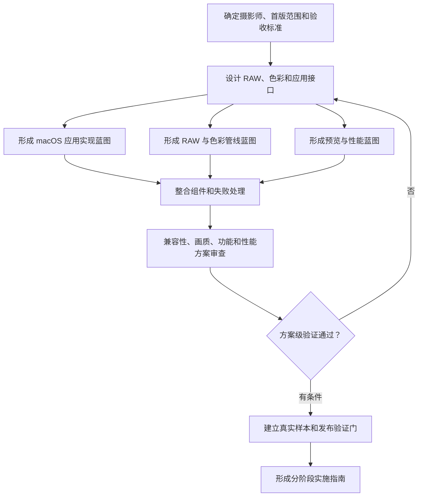
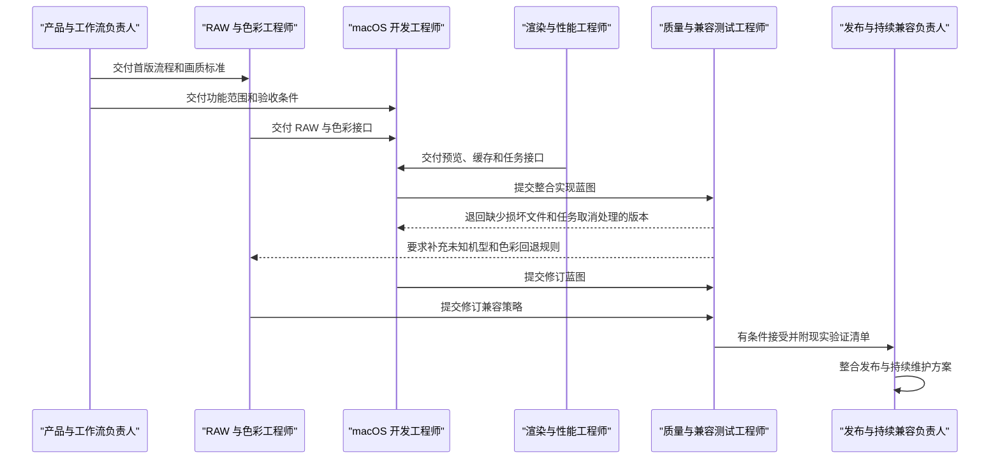
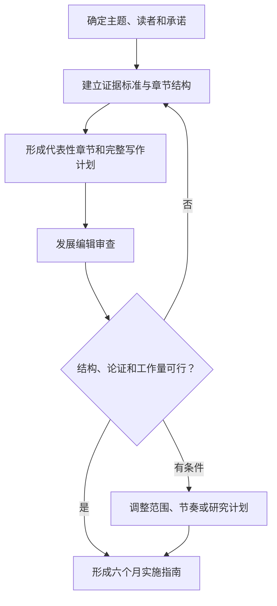
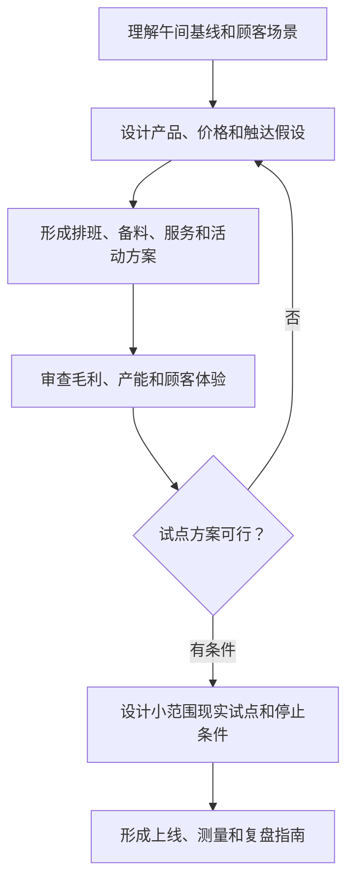
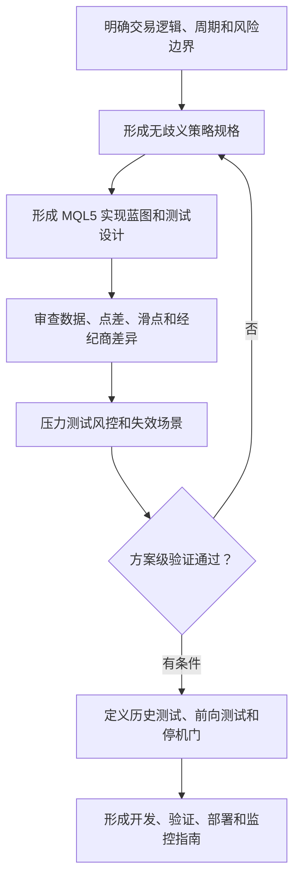

# Worked Examples

Use these examples to learn the transformation pattern and presentation style. Adapt every role, feasibility dimension, and implementation phase to the goal; never reuse a roster mechanically.

## Contents

1. [Trigger examples](#trigger-examples)
2. [Example 1: macOS RAW editing application](#example-1-macos-raw-editing-application)
3. [Example 2: Nonfiction manuscript](#example-2-nonfiction-manuscript)
4. [Example 3: Community café growth](#example-3-community-café-growth)
5. [Example 4: MT5 international-gold EA](#example-4-mt5-international-gold-ea)
6. [What these examples prove](#what-these-examples-prove)

## Trigger examples

These requests should trigger the Skill:

- “`$goal-orchestrator` 我的目标是创建一个 RAW 编辑应用。”
- “我只知道想做成什么，不知道具体应该怎么做。”
- “请组织完整专业团队推演方案，验证后给我一份实施指南。”
- “Use simulation to turn my goal into a feasibility-checked implementation roadmap.”

Requests for actual execution stay outside the boundary:

- “把方案发给我的团队。”
- “直接开发、签名并发布这个应用。”
- “连接账户运行 EA，并替我下单。”
- “联系真实用户完成可用性测试。”

Convert those parts into future implementation responsibilities and clearly mark the real actions unperformed.

## Example 1: macOS RAW editing application

**User goal:** 创建一个 RAW 编辑应用。

**Additional constraints:** 只开发 macOS；主要支持 Sony、Nikon 和 Fujifilm。

### 目标实现推演

以下方案通过模拟协作和方案级验证形成，可作为现实实施指南；尚未执行任何现实操作，标注的现实验证事项仍需完成。

### 先给结论

建议第一版聚焦“导入 → 基础非破坏编辑 → 流畅预览 → 导出”这条完整摄影流程，不在首版加入复杂图库管理。

**可行性结论：有条件可行。** 产品边界、模块职责、兼容策略、失败处理和测试路径可以形成闭环；但首发机型、真实 RAW 文件、色彩准确性、性能、内存、崩溃率以及 macOS 签名和公证仍需现实验证。

### 我理解的目标

用户最终想获得的是一款可以在 macOS 上使用的 RAW 照片编辑应用，而不是单纯的技术架构报告。为了继续形成方案，暂时按以下首版范围处理：

- 导入和浏览 RAW 照片。
- 调整曝光、白平衡、对比度和裁切，并保留原始文件。
- 快速预览调整结果。
- 导出常用图片格式。
- 对不支持、损坏或处理中断的文件给出明确反馈。

目标摄影师、图库深度、首发机型和性能标准仍需用户决定或现实测量。

### 这款应用怎样落地

实施重点是先把 RAW 管线、预览管线和 macOS 应用之间的接口固定下来，再由独立质量负责人检查兼容矩阵、失败路径和现实测试门。

### 完整实施团队

#### 产品负责人兼摄影工作流设计者

把目标转化为用户流程、首版范围和验收标准，决定什么必须首发、什么延后。

#### RAW 与色彩工程师

负责 RAW 解码、相机元数据、白平衡、色彩转换、品牌适配和未知机型回退策略，并设计真实样本矩阵。

#### macOS 应用开发工程师

负责导入、浏览、编辑状态、历史记录、导出和系统集成的实现蓝图，包括模块、接口、伪代码、依赖和失败路径。

#### 渲染与性能工程师

负责预览渲染、缓存、缩略图、后台任务、取消机制和大文件性能预算。

#### 质量与相机兼容性测试工程师

独立检查功能覆盖、错误路径、文件兼容矩阵、画质标准和性能测试设计，并有权驳回不完整的实现蓝图。

#### 发布与持续兼容负责人

负责签名、公证、安装包、版本回退、崩溃收集、相机支持更新和用户反馈闭环的实施方案。

#### 目标实现协调者

只负责阶段、交付物、验收门、冲突、返工和汇总，不兼任开发或测试。

### 方案怎样经过审查

最重要的返工来自质量审查：首版蓝图只覆盖正常流程，没有定义损坏文件、未知机型、缺失色彩配置和长任务取消。开发和 RAW 负责人补齐这些路径后，方案在规格层面闭环，但仍不能代替真实文件和设备测试。

### 现实实施指南

1. **确定首版产品基线**：确认目标摄影师、编辑工具、首发机型和验收标准；输出冻结的 MVP 范围。
2. **建立技术契约**：确定 RAW 解码、色彩、预览、编辑状态和导出接口；以接口评审作为进入开发的门槛。
3. **分组件实现**：RAW 管线、预览性能和 macOS 应用并行开发；每个组件必须包含错误处理和诊断信息。
4. **持续整合和现实测试**：使用真实品牌与机型样本检查导入、画质、导出、崩溃、内存和响应时间；不达标则回到对应组件。
5. **发布准备**：完成签名、公证、安装、回退、崩溃收集和隐私检查后再决定是否发布。
6. **持续兼容**：按新机型和系统版本维护样本库、兼容矩阵和优先级。

### 必须在现实中验证

- Sony、Nikon、Fujifilm 的具体首发机型和代表性文件。
- RAW 解码与参考软件之间的色彩和高光表现。
- 大文件下的内存、预览延迟、导出时间和崩溃率。
- macOS 版本兼容、签名、公证、安装和升级回退。
- 目标摄影师是否认可工作流和首版工具范围。

### 用户最值得决定的三件事

1. 首版主要服务专业摄影师、摄影爱好者，还是追求快速出片的普通用户？
2. 首版只做单张或文件夹编辑，还是必须包含图库和搜索？
3. 三个品牌分别优先支持哪些机型？

## Example 2: Nonfiction manuscript

**Goal:** 六个月内完成一部 6 万字的非虚构书稿。

Do not stop at thesis, research, and outline roles. Include the author who owns drafting, an independent developmental editor, a copy editor or proofreader when polished text is required, and a manuscript integrator.

The author role can produce a representative chapter treatment, prose sample, drafting schedule, and revision model sufficient to test voice, evidence, and workload. Do not claim that 60,000 words were written or six months elapsed. A responsible verdict will usually be conditional on source access, weekly writing capacity, and editorial availability.

## Example 3: Community café growth

**Goal:** 为一家社区咖啡店设计工作日午间营收提升方案，并给出现实实施指南。

Do not create only market, pricing, and finance analysts. Include store operations, campaign execution, customer experience, measurement, and an independent unit-economics reviewer.

The plan can validate arithmetic, staffing logic, service flow, measurement design, and downside scenarios. It cannot claim that staff were trained, customers responded, offers launched, or revenue increased. The likely verdict remains conditional until a bounded store pilot supplies real conversion, throughput, waste, and satisfaction evidence.

## Example 4: MT5 international-gold EA

**Goal:** 做一个 MT5 国际黄金 EA。

The complete team should include a strategy owner, quantitative specification role, MQL5 developer, independent data and backtest validator, execution and broker-compatibility owner, risk engineer, deployment and monitoring owner, and the Orchestrator. Do not let a market analyst or system architect replace development and testing.

A responsible result is normally `conditionally-viable`: the Skill can check rule completeness, position sizing formulas, execution assumptions, failure handling, test design, and overfitting controls, but it cannot claim profitability, broker compatibility, historical performance, forward performance, or live safety. The guide must require clean historical data, out-of-sample tests, spread and slippage stress, broker symbol checks, bounded demo forward testing, drawdown limits, emergency shutdown, and explicit go/no-go criteria before any live use.

## What these examples prove

- The user can begin with a simple outcome and receive a usable implementation path.
- Simulation is the method; the implementation guide is the deliverable.
- Capability-first generation and lifecycle closure are both required.
- Developers, writers, operators, testers, delivery owners, and risk owners remain present even though no external action occurs.
- Producer roles create representative work products that make the plan reviewable; they do not merely advise a future producer.
- Independent validation can reject and return work.
- A feasibility verdict names its scope, evidence, conditions, and reality checks.
- Mermaid makes paths and handoffs easier to understand than workflow tables.
- Plan-level completion never means the real goal has already been achieved.
