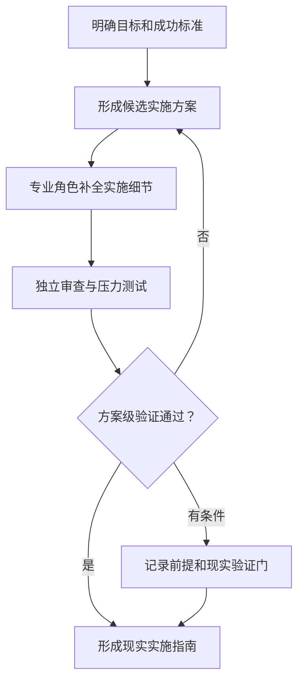

# Output Contracts

Use two output layers so a non-expert receives a useful implementation guide while structured traceability remains available for handoff, audit, or later execution.

## Contents

1. [Positioning and priority](#positioning-and-priority)
2. [Frontstage user contract](#frontstage-user-contract)
3. [Mermaid contract](#mermaid-contract)
4. [Backstage structured contract](#backstage-structured-contract)
5. [Evidence model](#evidence-model)
6. [Entity records](#entity-records)
7. [Final response sequence](#final-response-sequence)
8. [Compact and structured modes](#compact-and-structured-modes)

## Positioning and priority

The Chinese positioning is:

> 目标实现推演——把一个简单目标转化为经过模拟验证、可用于现实执行的方案。

Simulation is the method. The primary deliverable is a plan-level feasibility-checked implementation guide. Real execution remains outside the Skill.

When presentation goals compete, use this priority:

1. Truthful simulation and evidence boundary.
2. Clear recommendation and defensible feasibility verdict.
3. Plain-language comprehension.
4. Complete applicable lifecycle and role ownership.
5. Visual workflow clarity.
6. Structured traceability.

## Frontstage user contract

Write for a capable non-expert who understands the desired result but may not know the domain, roles, methods, vocabulary, or sequence.

### Boundary notice

Begin with one short localized statement that communicates:

- The plan was developed through simulated collaboration and plan-level validation.
- It is intended to guide later real implementation.
- No real action was performed and named reality checks remain outstanding.

Preferred Chinese wording:

> 以下方案通过模拟协作和方案级验证形成，可作为现实实施指南；尚未执行任何现实操作，标注的现实验证事项仍需完成。

Use the notice once. Do not attach “模拟” or “虚拟” to every role, artifact, stage, or sentence after the boundary is clear.

### Language rules

- Lead with what the user should do and the current feasibility verdict, not the internal method.
- Use normal professional titles such as “开发工程师,” “测试负责人,” and “运营负责人.”
- Translate technical terms or explain them on first use.
- Prefer “负责把 RAW 文件转换为可编辑图像” over “owns CAP4 and ART7.”
- Describe review evidence naturally: “方案审查发现导出流程缺少损坏文件处理,” not “测试已经证明应用正常.”
- Describe future real actions in future or conditional language; never turn a simulated event into past real progress.
- State whether the result is `方案级可行`, `有条件可行`, or `暂不具备可行性`, and explain why in ordinary language.
- Explain assumptions next to the conclusion they affect.
- End with one to three high-leverage decisions or first actions; do not hand the user a disguised questionnaire.
- Use the user's language and localized headings.

### Progressive disclosure

Keep these backstage by default:

- IDs such as `SG2`, `CAP4`, `R3`, `ART5`, and `EV6`.
- Raw evidence labels on every claim.
- Full role contracts and coverage matrices.
- Artifact registries and event ledgers.
- JSON or YAML.

Expose them when:

- The user requests structured or auditable data.
- The result will be handed to another system or professional team.
- A label prevents plan-level validation from being mistaken for real evidence.
- A dependency or coverage gap cannot be explained clearly without it.

## Mermaid contract

Use Mermaid whenever the result contains:

- Three or more dependent steps.
- Parallel work that later converges.
- Role-to-role handoffs.
- Review, rejection, revision, escalation, or a stop/go gate.
- An organization or decision structure with three or more relationships.

Choose the smallest useful diagram:

- `flowchart LR` or `flowchart TD` for implementation paths, branches, phases, and lifecycle flow.
- `sequenceDiagram` for handoffs and rework.
- `stateDiagram-v2` only when artifact or decision state is the main point.

Example:



Rendering rules:

- Use a fenced block beginning with exactly ```mermaid`.
- Put the diagram type on the first non-empty line.
- Quote labels containing spaces, punctuation, parentheses, or non-ASCII text.
- Give every node a stable local alias.
- Prefer syntax supported by common Mermaid renderers.
- Avoid raw HTML, Markdown links, custom JavaScript, initialization directives, and experimental syntax.
- Split diagrams beyond roughly 12–15 nodes or when scanning becomes difficult.
- Explain the takeaway in one short paragraph after the diagram.

Tables remain appropriate for compact comparisons, exact mappings, or structured appendices. A table must not be the sole representation of a multi-stage path or handoff loop.

## Backstage structured contract

Maintain these root properties when structured data is emitted:

```yaml
schema_version: "3.0"
positioning_zh: "目标实现推演"
tagline_zh: "把一个简单目标转化为经过模拟验证、可用于现实执行的方案"
execution_mode: simulation
simulation_only: true
deliverable_type: implementation_guide
external_actions_performed: []
user_language: "<language>"
goal: {}
lifecycle: []
subgoals: []
capabilities: []
roles: []
artifacts: []
workflow: []
events: []
coverage: {}
feasibility_assessment: {}
implementation_guide: {}
reality_checks_required: []
```

Use stable internal identifiers:

| Entity | Pattern |
|---|---|
| Root goal | `G0` |
| Subgoal | `SG<n>` |
| Capability | `CAP<n>` |
| Role | `R<n>`, with `R0` reserved for the Orchestrator |
| Artifact | `ART<n>` |
| Workflow phase | `WF<n>` |
| Simulation event | `EV<n>` |
| Assumption | `A<n>` |
| Unknown | `U<n>` |
| Risk | `RSK<n>` |
| Decision | `D<n>` |
| Reality check | `RC<n>` |

Never renumber an entity during replanning. Retain replaced records as `superseded`.

Use these statuses where applicable:

- `planned`
- `active`
- `blocked`
- `plan-reviewed`
- `accepted`
- `conditionally-accepted`
- `rejected`
- `superseded`

## Evidence model

Classify every material backstage claim:

| Label | Meaning |
|---|---|
| `USER_FACT` | Explicitly supplied by the user and not independently verified |
| `ASSUMPTION` | Introduced so a path can be evaluated |
| `DERIVED` | Follows transparently from labeled inputs |
| `SIMULATED` | Produced or observed only inside the plan simulation |
| `UNKNOWN` | Important information that is unavailable |

Never promote an assumption because several roles repeated it. A simulation event never creates real-world evidence.

Translate labels naturally in the frontstage layer:

- `ASSUMPTION`: “为了继续形成方案，我暂时按……处理。”
- `SIMULATED`: “在方案审查中，这个路径被指出……”
- `UNKNOWN`: “真正开始前还需要确认……”

Show raw labels only when the distinction itself matters.

## Entity records

### Goal brief

Record:

- `goal_id` and original wording.
- Plain-language target outcome and beneficiary.
- Horizon, constraints, resources, stakeholders, and exclusions.
- Definition of done.
- Assumption and unknown references.
- Execution boundary and current confidence.

### Lifecycle record

Create one record for every canonical stage:

- `stage`: `understand`, `plan`, `design`, `produce`, `validate`, `integrate`, `deliver`, `operate`, or `learn`.
- `applicability`: `applicable`, `not_applicable`, or `deferred`.
- `reason`.
- `accountable_role_ids`.
- `expected_artifact_ids`.
- `reality_check_ids`.

A stage cannot be marked `not_applicable` merely because external execution is forbidden.

### Subgoal record

Record `subgoal_id`, observable outcome, parent, rationale, dependencies, constraints, completion evidence, lifecycle stages, implementation-guide phases, and status.

### Capability record

Record `capability_id`, name, purpose, subgoals, lifecycle stages, required depth, inputs, simulation limit, accountable role, and reality evidence needed.

### Artifact record

Record:

- Artifact ID, name, producer, consumers, lifecycle stage, and contribution mode.
- Source IDs and a concise content summary.
- Acceptance criteria and independent validator where required.
- Evidence labels, status, and `created_in_simulation: true`.
- Reality checks that remain unperformed.

If an artifact is rejected, preserve it and create a revision. Do not rewrite history.

### Workflow record

Record phase ID, outcome-oriented name, entry conditions, active roles, simulation activities, artifacts, exit gate, rejection route, and linked implementation-guide phase. Render the visible path with Mermaid.

### Event record

Log only material events:

- Actor and bounded simulation action.
- Consumed and produced artifacts.
- Contribution mode: `coordinate`, `decide`, `design`, `produce`, `validate`, `integrate`, `deliver`, `operate`, or `challenge`.
- Findings, decisions, issues, state change, and status.
- Real action explicitly not performed when confusion is plausible.

Use event order, not fictional timestamps.

### Feasibility assessment

Record:

- `status`: `plan-viable`, `conditionally-viable`, or `not-yet-viable`.
- `scope`: always `plan-level`.
- Assessed dimensions and their evidence.
- Supporting findings and failed checks.
- Conditions, blockers, confidence, and sensitivity to assumptions.
- Reality checks required to replace remaining uncertainty.

`plan-viable` means no known plan-level blocker remains under stated facts and assumptions. It never means the result has been proven in reality.

### Implementation guide

Record:

- Recommended path and rationale.
- Ordered phases with owners, prerequisites, proposed real actions, expected outputs, and acceptance gates.
- Decision points, fallback branches, stop conditions, and handoff notes.
- First actions the user or future team can take.
- Reality checks linked to the phase in which they must occur.

Keep proposed real actions clearly future-facing; they are instructions, not event claims.

### Reality check

Record `reality_check_id`, question, why it matters, owner, method, sample or environment, acceptance threshold, timing, failure route, and dependent conclusions.

### Coverage record

Check:

- Definition-of-done to subgoal and guide-phase coverage.
- Subgoal to capability coverage.
- Applicable lifecycle stage to accountable role coverage.
- Primary artifact to producer coverage.
- Critical artifact to validator coverage.
- Handoff and consumer closure.
- Feasibility dimensions, reality checks, boundary, Mermaid, comprehension, and traceability gates.

## Final response sequence

Use these concepts in order, but localize and simplify headings:

1. **One-time boundary and goal understanding.**
2. **Recommended path and feasibility verdict.**
3. **How the goal can be implemented**, with an end-to-end Mermaid diagram.
4. **Complete implementation team**, described by responsibility and value.
5. **Why the plan passed, changed, or remains conditional**, including decisive rejection and revision.
6. **Reality-ready implementation guide**, phased and actionable.
7. **Reality checks, risks, and highest-leverage user decisions.**
8. **Optional structured appendix**, only when requested or useful.

Do not lead with a team roster, event ledger, or coverage matrix. Do not make a non-expert read the simulation history before seeing the recommendation.

## Compact and structured modes

For a compact result:

- Keep the one-time boundary, plain-language goal, recommendation, feasibility verdict, one Mermaid path, complete role coverage in summary form, decisive review finding, implementation phases, reality checks, and key decisions.
- Omit internal IDs and low-value event detail.

For structured data:

- Validate roles against [role.schema.json](role.schema.json).
- Preserve stable identifiers and evidence labels.
- Include lifecycle applicability, coverage, `feasibility_assessment`, `implementation_guide`, and `reality_checks_required`.
- Keep `execution_mode: simulation`, `simulation_only: true`, and `external_actions_performed: []`.
- Never emit `actual_outcome` for a plan simulation.

For a professional handoff:

- Present the friendly summary first.
- Add structured data after it.
- Clearly separate plan-level findings, proposed future actions, and real evidence still required.
