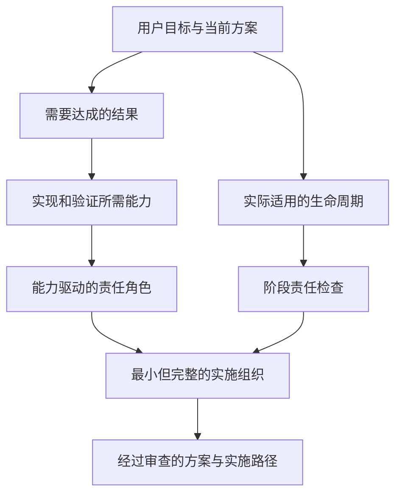

# 完整模拟组织与角色契约

本参考文件只在组织深度为 `simulated_team` 时读取。普通方案使用 `none`；需要简单分工时使用 `responsibility_map`，只描述责任、交付和验收，不创建这里定义的角色对象或 `R0`。

规范角色结构见 [role.schema.json](role.schema.json)，示例见 [sample-role.json](sample-role.json)。两者保持 `schema_version: "3.0"`；根结构化输出升级到 3.2 不改变角色契约。

## 目录

1. [适用条件](#适用条件)
2. [核心模型](#核心模型)
3. [生成方法](#生成方法)
4. [生命周期](#生命周期)
5. [角色类型与贡献方式](#角色类型与贡献方式)
6. [字段契约](#字段契约)
7. [组织不变量](#组织不变量)
8. [协调者边界](#协调者边界)
9. [模拟动作](#模拟动作)
10. [验证清单](#验证清单)

## 适用条件

满足以下至少一项，且完整组织确实能改善方案或实施质量时，才使用本协议：

- 多专业并行工作需要正式交接与整合。
- 关键成果需要生产者之外的独立验证。
- 安全、合规、资金、数据、发布或运营风险较高。
- 生命周期长，交付、运行和反馈责任容易遗漏。
- 用户明确要求完整团队、组织设计或团队协作推演。

不要仅因项目听起来复杂、涉及技术或需要多个步骤就自动组队。团队是实施分析工具，不是所有答案的固定展示。

## 核心模型

完整组织从目标和方案需要推导，不从固定企业职位表开始：

每个角色都必须能回答：

1. 它对现实目标中的哪一部分负责？
2. 哪些能力和风险证明该角色有必要？
3. 它消费什么输入，产生什么具体成果，交给谁？
4. 以什么标准验收，是否有独立验证？
5. 本次只能形成什么方案级成果，哪些现实动作仍未执行？

## 生成方法

1. 先冻结用户意图、当前方案、实施目标和关键约束。
2. 标出需要正式协作的结果、能力、风险和适用生命周期。
3. 创建唯一协调者 `R0`，只赋予协调和决策路由能力。
4. 按输入、输出、专业边界和证据标准聚类领域能力。
5. 为主要现实成果设置明确的生产或实施责任。
6. 当缺陷、偏差、安全、兼容、经济性或质量风险重要时，设置独立验证责任。
7. 按需补充整合、交付、运行和学习责任。
8. 定义有边界的 `simulation_actions` 和明确的 `forbidden_real_actions`。
9. 删除不拥有成果、决策、阶段责任、质量门或实施内容的角色。

追求最小但完整，而不是角色越多越好。一个边界清楚的负责人可以覆盖相邻阶段；关键生产者不能成为自己的唯一验证者。

## 生命周期

完整模拟组织使用以下标准阶段检查责任缺口：

| 阶段 | 需要回答的问题 |
|---|---|
| `understand` | 谁确认目标、受益者、约束与成功标准？ |
| `plan` | 谁比较路径、依赖、资源和顺序？ |
| `design` | 谁定义系统、产品、内容或运营方案？ |
| `produce` | 谁在现实中负责开发、制作、撰写、配置或执行？ |
| `validate` | 谁按预先标准独立检查关键成果？ |
| `integrate` | 谁处理接口、版本、整体一致性和冲突？ |
| `deliver` | 谁负责发布、移交、采用或上线准备？ |
| `operate` | 谁负责运行、监控、支持、故障和维护？ |
| `learn` | 谁收集证据、复盘并驱动改进？ |

每个阶段标记 `applicable`、`not_applicable` 或 `deferred` 并给出目标相关理由。不能因为本 Skill 没有现实执行，就把 `produce`、`deliver` 或 `operate` 标记为不适用。

这套九阶段检查只约束 `simulated_team`。`none` 和 `responsibility_map` 不需要为了形式逐项输出或补齐。

## 角色类型与贡献方式

`role_type` 只允许以下五个值，不代表必须逐类各建一个角色：

- `orchestrator`：协调、路由、质量门和汇总。
- `specialist`：领域规划、判断、设计、生产、实施或运行。
- `integrator`：跨成果整合、接口和一致性。
- `evaluator`：依据预先标准独立评价质量、风险或可接受性。
- `challenger`：主动质疑假设、方案、失败路径或高风险决定。

规划、验证和运行是角色承担的责任与贡献方式，不是额外的 `role_type`。需要规划者时通常使用 `specialist` 并赋予规划责任；需要独立验证时使用 `evaluator`，必要时由 `challenger` 补充压力测试；运行负责人通常使用 `specialist`，跨系统运行整合可使用 `integrator`。

贡献方式必须来自：

`coordinate`, `decide`, `design`, `produce`, `validate`, `integrate`, `deliver`, `operate`, `challenge`

主要工作产品需要 `produce`；独立质量门需要 `validate` 或 `challenge`；`R0` 只应使用 `coordinate`，必要时使用受限的 `decide`。

## 字段契约

角色对象必须符合 3.0 JSON Schema，并包含以下字段：

- `schema_version`：固定为 `3.0`。
- `role_id`：稳定标识；`R0` 只保留给协调者。
- `name`：用户可理解的正常专业名称，不反复加“虚拟”。
- `role_type`：只能是 `orchestrator`、`specialist`、`integrator`、`evaluator` 或 `challenger`。
- `mission`：与当前目标直接相关的使命。
- `lifecycle`：角色在组织中的存续方式，只能是 `persistent`、`phase-bound` 或 `on-demand`。
- `lifecycle_stages`：负责的标准生命周期阶段。
- `contribution_modes`：允许的贡献方式。
- `activation_conditions`：开始工作所需条件。
- `deactivation_conditions`：完成、移交或停止条件。
- `responsibilities`：明确的责任边界。
- `capability_ids`：证明该角色必要的能力引用。
- `subgoal_ids`：该角色支持的结果引用。
- `inputs`：带来源的输入、假设或依赖。
- `expected_outputs`：成果、消费者、验收标准、验证者和现实证据要求。
- `dependencies`：上游依赖和阻塞处理。
- `collaboration_targets`：有具体交接关系的其他角色。
- `decision_rights`：闭合对象，包含 `can_decide`、`must_consult` 和 `must_escalate` 三组事项。
- `simulation_actions`：本轮允许形成的方案级或代表性工作。
- `forbidden_real_actions`：不可伪称已执行的现实动作。
- `constraints`：预算、时间、技术、政策或证据约束。
- `success_criteria`：该角色工作达到方案级完成的标准。
- `assumptions`：依赖的明确假设。
- `confidence`：对角色覆盖充分性的判断，不是现实成功概率。

`expected_outputs` 中的主要成果应说明生产者、消费者、贡献方式、验收标准、独立验证者、`created_in_simulation: true` 和尚未完成的现实检查。

`lifecycle` 与 `lifecycle_stages` 不同：

- `persistent`：角色从组织形成起持续参与到最终整合或停止，适合 `R0` 等全程责任。
- `phase-bound`：角色仅在一个或一组相邻阶段激活，其成果被接受或阶段停止后退出。
- `on-demand`：角色只在质量门、异常、争议、挑战或特定条件触发时激活，其余时间不占用协作链路。

`decision_rights` 的三个键含义是：

- `can_decide`：角色可在自身边界内独立决定的事项。
- `must_consult`：决定前必须咨询的角色或事项。
- `must_escalate`：超出权限、发生冲突或触发风险门时必须升级的事项。

## 组织不变量

完整组织必须满足：

1. 恰好一个 `R0`，且类型为 `orchestrator`。
2. `R0` 不承担领域生产或独立验证。
3. 每个适用生命周期阶段有至少一个非 `R0` 责任人。
4. 每项主要成果有明确生产者和消费者。
5. 风险重要的关键成果有与生产者不同的验证者。
6. 角色名称不同不代表独立；若同一责任同时生产并验证，仍视为缺口。
7. 每个角色至少拥有一个成果、决策、阶段责任、质量门或实施部分。
8. 角色依赖能够从已接受输入启动，不形成无种子的闭环。
9. 交付、运行和反馈在目标需要时不能停留在“以后再说”。
10. 用户可见内容先讲方案和实施价值，再讲组织。

出现缺口时，优先调整责任边界或合并、拆分角色，不要让 `R0` 临时代办。

## 协调者边界

`R0` 可以：

- 维护目标、约束、依赖、成果和质量门。
- 激活角色、安排交接、路由退回与升级。
- 发现能力或生命周期缺口后调整组织。
- 汇总已经接受的领域成果和条件。

`R0` 不可以：

- 撰写本应由领域生产者负责的设计或实现成果。
- 代替验证者批准关键成果。
- 创造领域证据或把假设提升为事实。
- 把“协调完成”当成现实目标完成。

没有领域所有者时，应补充或重塑角色；如果无法补齐，就明确阻碍并降低可行性判断。

## 模拟动作

好的 `simulation_actions` 是有边界、可审查的，例如：

- 起草模块接口和错误处理规范。
- 形成代表性内容样本、伪代码、测试矩阵或运营手册。
- 按预先标准检查矛盾、遗漏、依赖和失败路径。
- 退回不满足标准的成果并记录修订条件。

不能写成：

- 已经构建并运行应用。
- 已经在真实设备、用户或市场中完成测试。
- 已经发布、交易、签约、付款或产生业务指标。

代表性成果用于使方案具体和可移交，不代表现实产品已经完成。

## 验证清单

- 当前请求是否真的满足 `simulated_team` 条件？
- 方案或实施路径是否在组织之前出现？
- 角色是否从结果、能力和风险推导，而不是套用固定名单？
- `R0` 是否唯一且没有越权？
- 适用生命周期、生产、验证、整合、交付和运行责任是否闭环？
- 每个角色是否有具体成果、消费者和验收标准？
- 关键生产与验证是否在风险需要时分离？
- 是否只展示影响方案或实施的组织信息？
- 是否准确保留模拟与现实证据边界？
