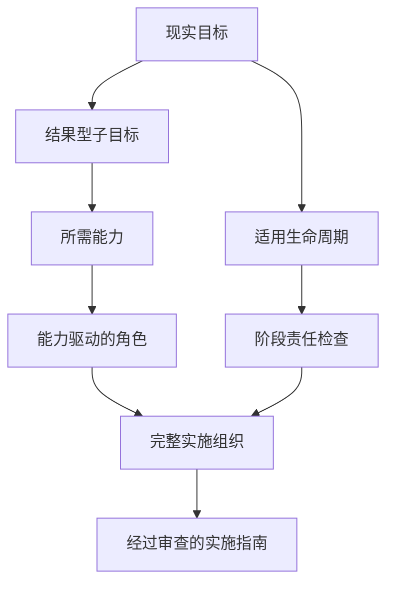

# Role Schema and Complete-Organization Rules

Treat a role as a temporary organizational position required to turn one real goal into a credible implementation guide, not as a persona. The canonical machine-readable contract is [role.schema.json](role.schema.json).

## Contents

1. [Core model](#core-model)
2. [Two-pass generation](#two-pass-generation)
3. [Lifecycle completeness](#lifecycle-completeness)
4. [Role types and contribution modes](#role-types-and-contribution-modes)
5. [Required fields](#required-fields)
6. [Organization invariants](#organization-invariants)
7. [Clustering and splitting](#clustering-and-splitting)
8. [Simulation action contract](#simulation-action-contract)
9. [Orchestrator restrictions](#orchestrator-restrictions)
10. [Validation checklist](#validation-checklist)

## Core model

Use both causal chains:

Capability provenance prevents arbitrary titles. Lifecycle closure prevents an advisory-only team. The organization exists to make the plan concrete and reviewable; it does not claim to have executed the plan.

Every role must answer:

1. Which real part of the goal would this position own?
2. Which capabilities justify it?
3. Which lifecycle stages and contribution modes does it cover?
4. Which accepted inputs activate it?
5. Which plan-level or representative work product does it create, for whom, and at what quality?
6. Which section of the implementation guide depends on its work?
7. Which real actions and evidence remain unperformed?

## Two-pass generation

Generate roles in this order:

1. Freeze the current subgoal and capability maps.
2. Mark every lifecycle stage applicable, not applicable, or deferred.
3. Create `R0` with only orchestration capabilities and `coordinate` or `decide` modes.
4. Group compatible domain capabilities by inputs, outputs, evidence standard, and stage.
5. Create accountable producer or implementer roles for every primary real-world responsibility.
6. Create independent validation roles where defects, bias, safety, compatibility, economics, or quality matter.
7. Add integration, delivery, operation, and learning ownership where required.
8. Define bounded `simulation_actions` and explicit `forbidden_real_actions`.
9. Remove roles that add no artifact, decision, lifecycle ownership, guide section, or quality gate.
10. Run capability, lifecycle, feasibility, and guide-ownership checks together.

Prefer the smallest complete roster. Combine compatible responsibilities for bounded goals; allow more roles for complex products. Never remove a necessary implementer or validator merely because no external execution occurs.

## Lifecycle completeness

Use these canonical stages:

| Stage | Question the organization must answer |
|---|---|
| `understand` | Who clarifies the beneficiary, context, constraints, and success? |
| `plan` | Who sequences work, resources, and decisions? |
| `design` | Who specifies the solution before production? |
| `produce` | Who would perform the core domain work and makes that work concrete enough to assess? |
| `validate` | Who independently checks the plan and representative artifacts? |
| `integrate` | Who reconciles accepted components into one guide? |
| `deliver` | Who prepares handoff, release, adoption, or launch? |
| `operate` | Who owns use, maintenance, service, or ongoing execution? |
| `learn` | Who measures real results and routes feedback into improvement? |

Not every goal needs every stage, but every omission needs a goal-specific reason. “The Skill does not execute reality” is never a valid omission reason.

Examples of `produce` ownership:

- Software: application, data, algorithm, integration, or platform developers.
- Book: author or writer.
- Event: content, logistics, production, and on-site operations owners.
- Commercial initiative: offer, campaign, sales, service, and store-operation owners.
- Physical product: product engineering, manufacturing, sourcing, and quality owners.

During simulation, these roles create representative specifications, samples, implementation blueprints, operating procedures, or testable handoff artifacts. They do not claim the final real product exists.

## Role types and contribution modes

Role type describes organizational position:

| Role type | Purpose |
|---|---|
| `orchestrator` | Decompose, route, gate, replan, and synthesize |
| `specialist` | Own domain-specific design, production, delivery, or operation |
| `integrator` | Reconcile accepted work into a coherent path and guide |
| `evaluator` | Independently judge work against declared criteria |
| `challenger` | Stress-test assumptions, scenarios, economics, or failure modes |

Contribution mode describes what the role contributes:

- `coordinate`
- `decide`
- `design`
- `produce`
- `validate`
- `integrate`
- `deliver`
- `operate`
- `challenge`

A specialist may contribute through `produce`, `deliver`, or `operate`; do not reduce “specialist” to “adviser.”

## Required fields

Every role object must contain:

| Field | Design intent |
|---|---|
| `schema_version` | Use `3.0` |
| `role_id` | `R0` for the Orchestrator, then `R1`, `R2`, and so on |
| `name` | Normal, functional, goal-specific position name |
| `role_type` | One canonical organizational type |
| `mission` | Plan-level result the role must cause without claiming real execution |
| `lifecycle` | `persistent`, `phase-bound`, or `on-demand` |
| `lifecycle_stages` | Stages with material responsibility |
| `contribution_modes` | Material contributions made during simulation |
| `activation_conditions` | Accepted conditions required to begin |
| `deactivation_conditions` | Conditions that end the assignment |
| `responsibilities` | Non-overlapping real-world accountabilities represented in the plan |
| `capability_ids` | Capabilities that justify the role |
| `subgoal_ids` | Outcomes served by the role |
| `inputs` | Provenance and acceptance criteria |
| `expected_outputs` | Reviewable work products, consumers, and acceptance criteria |
| `dependencies` | Role and artifact dependencies |
| `collaboration_targets` | Purpose, cadence, and exchanged artifacts |
| `decision_rights` | May decide, must consult, and must escalate |
| `simulation_actions` | Bounded actions allowed while developing and testing the plan |
| `forbidden_real_actions` | Similar real actions that remain unperformed |
| `constraints` | Scope, evidence, safety, time, and quality limits |
| `success_criteria` | Observable plan-level checks |
| `assumptions` | Material `A<n>` references |
| `confidence` | 0–1 adequacy of role design, not real competence or success probability |

Use [sample-role.json](sample-role.json) as a structural example. It shows an implementation role so “simulation” cannot be misread as planning without builders.

## Organization invariants

Enforce all of these:

1. **Single orchestration authority:** Exactly one `R0` has `role_type: orchestrator`.
2. **Capability-first provenance:** Every role traces to required capabilities.
3. **Lifecycle closure:** Every applicable stage has accountable domain ownership.
4. **Core production:** Every primary deliverable has a role with `produce`.
5. **Independent validation:** Every critical deliverable has a distinct `validate` owner when needed.
6. **Delivery ownership:** Goals implying launch, release, handoff, or adoption have `deliver` ownership.
7. **Operational ownership:** Goals continuing after delivery have `operate` and, when useful, `learn` ownership.
8. **Guide contribution:** Every role contributes to an artifact, decision, gate, or implementation-guide section.
9. **Artifact purpose:** Every expected output has a consumer or contributes to `FINAL`.
10. **Input provenance:** Every input comes from `USER`, `SIMULATION`, or a named role or artifact.
11. **No circular deadlock:** Iteration loops have an explicit seed and rejection route.
12. **Separation of duties:** A material producer is not its only evaluator.
13. **Bounded authority:** Decision rights do not exceed mission and capabilities.
14. **Truth boundary:** Simulation actions are meaningful, and equivalent real actions are explicitly forbidden.
15. **No decorative roles:** Every role owns work, a decision, a stage, or a quality gate.
16. **No advisory imbalance:** A build-oriented goal cannot have more planning roles merely because work is being simulated.

## Clustering and splitting

Cluster responsibilities when they share inputs, produce one coherent artifact family, use compatible evidence, occur in nearby stages, and do not weaken independent review.

Split responsibilities when:

- One role would produce and solely approve a critical result.
- Design and production require materially different capabilities.
- Outputs have different consumers or rejection routes.
- Integration would obscure component ownership.
- Delivery or operation has risks not owned during design.
- A single mission contains unrelated responsibilities.

Do not create roles merely to imitate meetings. Do create implementers, testers, delivery owners, and operators when the real goal needs them.

## Simulation action contract

Each role must distinguish two lists.

`simulation_actions` may include:

- Analyze accepted inputs and assumptions.
- Design a solution, process, product, service, or operating model.
- Produce specifications, pseudocode, representative content, mock records, financial models, implementation blueprints, checklists, or runbooks.
- Review artifacts against declared criteria.
- Reject, revise, integrate, or hand off artifacts.
- Rehearse delivery, operation, incidents, and feedback using explicit assumptions.
- Contribute accepted findings to the implementation guide.

`forbidden_real_actions` must name plausible boundary mistakes, such as:

- Writing to or running a real repository.
- Compiling or benchmarking a real application.
- Testing actual hardware, files, customers, or operating environments.
- Contacting users, suppliers, staff, or reviewers.
- Spending money, publishing, signing, deploying, trading, or changing an account.
- Claiming observed metrics, feedback, approvals, or elapsed progress.

A role is incomplete if its simulation actions are empty or purely conversational.

## Orchestrator restrictions

`R0` may normalize the goal, maintain traceability, activate roles, route artifacts, enforce gates, surface conflicts, trigger up to two redesign cycles, synthesize accepted work, and assemble the implementation guide.

`R0` must not:

- Produce domain work because an implementer is absent.
- Count coordination as lifecycle production, validation, delivery, or operation coverage.
- Approve its own specialist result.
- Invent evidence or upgrade assumptions.
- Erase rejection, dissent, blockers, or unknowns.
- Turn plan-level validation into a real-world success claim.

When a missing capability or stage owner emerges, add or reshape the appropriate role and record a replan event.

## Validation checklist

- [ ] The roster follows outcome, lifecycle, and capability analysis.
- [ ] `R0` is the only Orchestrator and owns no domain artifact.
- [ ] Every role has lifecycle stages and contribution modes.
- [ ] Every applicable stage has accountable non-orchestrator coverage.
- [ ] Every primary work product has a `produce` owner.
- [ ] Every critical product has independent `validate` coverage.
- [ ] Delivery, operation, and learning are owned where applicable.
- [ ] Every input has provenance and every output has a consumer.
- [ ] Dependencies are acyclic or explicitly iterative.
- [ ] Simulation and forbidden real actions are both concrete.
- [ ] Every role contributes to the final guide or its validation.
- [ ] The visible team description uses normal titles and is understandable without IDs.
