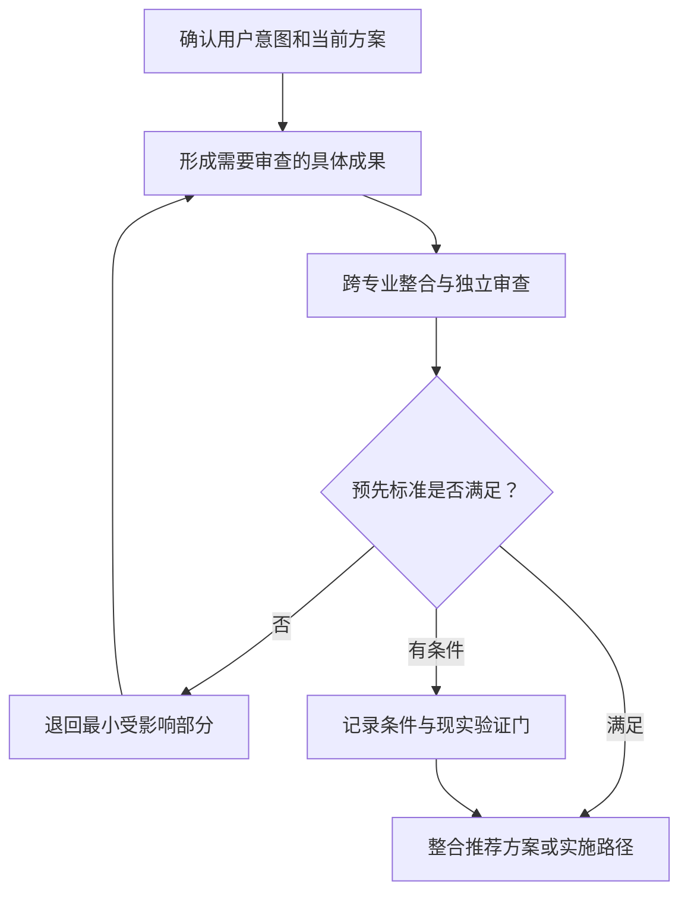
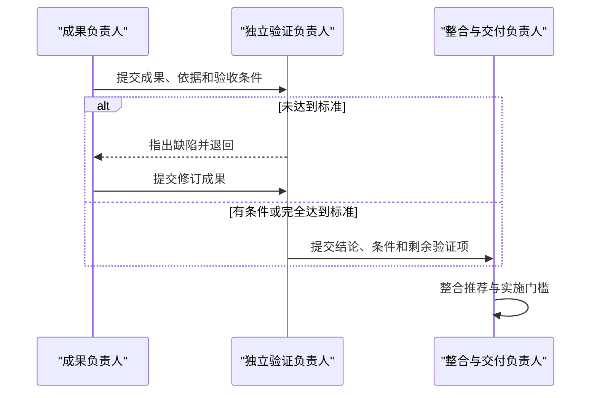

# 完整组织的方案推演协议

仅当组织深度为 `simulated_team` 时使用本协议。它让完整组织围绕已经理解的用户意图形成、审查和改进方案与实施路径；不能把模拟组织本身变成交付物的主角。

普通方案、架构比较、简单目标和责任映射不执行本协议，也不需要为了满足协议而补团队、审查记录、可行性标签或边界声明。

## 目录

1. [进入条件](#进入条件)
2. [边界与产出](#边界与产出)
3. [开始前状态](#开始前状态)
4. [状态与证据](#状态与证据)
5. [推演过程](#推演过程)
6. [成果与交接](#成果与交接)
7. [方案级可行性](#方案级可行性)
8. [冲突、返工与停止](#冲突返工与停止)
9. [失败模式](#失败模式)
10. [完整性检查](#完整性检查)

## 进入条件

只有以下因素之一真实存在，且完整组织能够提高答案质量时才进入：

- 复杂协作或跨专业并行工作。
- 多个关键交接和整合点。
- 关键成果需要生产者之外的独立验证。
- 安全、合规、资金、隐私、数据、兼容、发布或运行风险高。
- 用户明确要求完整团队、组织推演或协作审查。

进入前必须已经判断用户要的是具体方案、目标实现，还是既有方案实施。推演服务于该意图：

- 方案请求：先形成具体方案，再让组织审查高风险或跨域部分；实施仍然可以保持简要。
- 目标请求：组织可同时完善实质方案和详细实施路径。
- 既有方案实施：尊重既定方案，组织围绕实施、验证、交付和运行展开；除非发现阻断问题，不重做选型。

## 边界与产出

推演允许：

- 解释目标、约束和成功标准。
- 设计方案、系统、产品、服务、内容或运营模型。
- 形成规格、接口、伪代码、代表性样本、财务模型、测试设计、检查表和运行手册。
- 按预先标准审查成果，发现逻辑、覆盖、依赖、接口、成本、安全和证据缺口。
- 退回、修订、分支和整合方案。
- 在明确假设下演练交付、运行、故障和反馈。

推演不能被描述为已经发生的现实开发、运行、用户研究、设备测试、部署、审批、交易、营收或时间流逝。只读资料、代码检查或工具实际取得的证据应按真实来源说明，也不能因为进入模拟协议而改写成模拟发现。

用户可见边界自然说明一次：

> 以下组织协作与审查属于方案推演，尚未执行现实开发、测试或发布；相关结论仍需按文中的验证条件确认。

方案或实施重点应先出现；不要用边界声明和团队介绍抢占第一屏。

用户可见文本第一次出现协调责任时，写成“目标实现协调者（R0）”或“协调负责人（R0，唯一）”即可，后文继续用正常职称。这样读者能识别唯一协调者，又不会被角色编号和机械角色表打断。

## 开始前状态

开始角色协作前，至少存在：

1. 已判断的用户交付意图及其主次。
2. 当前可用的具体方案；对于目标请求，可以是待完善的候选方案。
3. 用户事实、关键假设、未知和成功标准。
4. 需要组织解决的结果、能力、风险和生命周期缺口。
5. 符合 [role-schema.md](role-schema.md) 的最小完整组织。
6. 需要生产、审查或整合的代表性成果及预先验收标准。
7. 可行路径、退回路线和不能由推演解决的现实检查。

不要先创建角色，再反向发明它们要解决的问题。

## 状态与证据

按复杂度维护必要状态，不要求在用户界面全部输出：

| 集合 | 内容 |
|---|---|
| `goal_state` | 用户目标、当前方案、约束和成功标准 |
| `capabilities` | 组织必须提供的实现、判断和验证能力 |
| `roles` | 角色边界、激活条件和贡献方式 |
| `artifacts` | 计划、草拟、接受、有条件接受、退回、修订或替代的成果 |
| `assumptions` | 假设及受其影响的结论 |
| `unknowns` | 缺少的现实信息、影响和验证方法 |
| `risks` | 触发、影响、负责人、缓解和停止条件 |
| `decisions` | 选项、标准、决策权和结果 |
| `events` | 真正改变成果、路径、判断或实施指南的事件 |
| `feasibility_assessment` | 方案级检查、条件、阻碍和状态 |
| `reality_checks_required` | 只有现实证据才能回答的问题 |

重要主张使用 `USER_FACT`、`ASSUMPTION`、`DERIVED`、`SIMULATED` 或 `UNKNOWN`。重复假设不能使其变成事实。拒绝和替代的成果应保留追溯状态，不能改写历史。

## 推演过程

根据问题合并或省略不适用的轮次，但保留真正需要的生产、独立验证、整合与交付责任。

### 形成实质成果

- 生产或实施责任形成足以检查方案的具体成果，例如接口、数据模型、流程、规则、代表性样本、伪代码、测试矩阵或运行手册。
- 方案请求把工作集中在核心设计和高风险取舍，不因使用团队就自动扩成完整项目计划。
- 目标请求先填补方案内容，再形成与复杂度匹配的实施路径。
- 既有方案实施只补实施所需细节，除非已知冲突迫使局部调整。
- 成果标记 `created_in_simulation: true`，但用户可见文本不必反复使用“模拟”前缀。

### 独立审查

- 关键成果交给不同于其设计者和实现者的独立验证责任；`R0` 只路由质量门，不担任独立验证者。
- 验收标准在审查前确定，不能看到结果后降低标准。
- 检查内部逻辑、接口、依赖、错误路径、资源、质量、安全和可测试性。
- 将方案层能判断的内容与必须现实执行的测试分开。
- 结果只能是接受、有条件接受或退回。

### 修订与整合

- 将缺陷退回负责的生产者，修订最小受影响成果。
- 保留退回版本及原因；不要把修订写成第一次就正确。
- 跨成果冲突由整合责任协调共享契约。
- 只把改变推荐、实施门槛或可行性判断的事件呈现给用户。

### 交付与运行演练

目标需要上线、采用、运营、维护或学习时，检查责任、移交条件、观察信号、故障处理、回退和反馈。方案请求若只涉及设计，可以只指出这些接口，不必强行展开完整运行计划。

## 成果与交接

每个关键交接遵循：

交接包含：

1. **提交：** 生产者说明成果、依据、假设和未做的现实检查。
2. **接收：** 下游确认输入完整且角色有权处理。
3. **审查：** 验证者使用预先标准。
4. **处置：** 接受、有条件接受或退回。
5. **路由：** 继续、修订、分支、升级或停止。

有条件接受必须记录未解决条件，不能在下游把它当成事实。

## 方案级可行性

只有用户要求可行性判断，或复杂实施确实需要正式质量门时才分配状态。可检查：

- 目标、需求、责任和实施覆盖。
- 逻辑、计算、接口和假设的一致性。
- 技术或方法在规格层的合理性。
- 资源类别、成本模型和顺序依赖。
- 运行责任、失败处理与恢复设计。
- 错误路径、安全、质量和现实测试设计。

不能仅靠推演证明：

- 编译、运行、崩溃、延迟、内存或基准表现。
- 设备、平台、格式、经纪商或操作系统兼容性。
- 用户偏好、付费意愿、需求、采用或满意度。
- 真实产能、人员表现、服务质量或运营结果。
- 法律意见、认证、签名、公证或商店审核。
- 现实收入、收益、损失、成本、周期或质量。

状态为：

- `plan-viable`：适用的方案级门通过，在事实和假设下无已知阻碍；现实检查仍需明确。
- `conditionally-viable`：路径基本成立，但依赖明确证据、资源、批准、集成或测试。
- `not-yet-viable`：已知阻碍、矛盾或不可接受风险阻止当前推荐。

不要给普通技术方案机械添加状态，也不要把置信度写成现实成功概率。

## 冲突、返工与停止

| 情况 | 默认处理 |
|---|---|
| 成果缺陷 | 原生产者按既有标准修订 |
| 接口冲突 | 整合责任协调共享契约 |
| 生产者与验证者分歧 | 决策责任按预先质量门裁决 |
| 缺少能力或阶段责任 | `R0` 调整角色，不亲自补位 |
| 证据争议 | 采用最保守且可辩护的标签 |
| 与用户目标冲突 | 分支或把真正决定交还用户 |
| 可行性阻碍 | 缩小范围、更换路径、增加前提或停止 |
| 边界违规 | 停止并改写为诚实的未来动作或方案结论 |

结构性重设计最多两轮。同一阻碍仍然存在时，公开条件或判为暂不具备可行性，不虚构进展。

结束条件与用户请求匹配：

- 方案请求：核心设计、关键取舍和必要验证已经足够具体，组织审查没有挤掉方案。
- 目标请求：实质方案和实施路径均已形成，必要责任与验证闭环。
- 既有方案实施：基线被尊重，拆分、依赖、交接、验收、发布与回退足以执行。
- 正式可行性判断：条件和现实检查与结论一致。

## 失败模式

- **组织先行：** 先列团队，再寻找它们要做什么。
- **方案空心化：** 角色和流程很多，却没有具体技术、产品或业务内容。
- **顾问组织：** 只有策略和架构，没有生产、验证或运行责任。
- **协调者越权：** `R0` 填补所有领域缺口。
- **角色表演：** 对话替代成果、标准、决策和修改。
- **虚构执行：** 声称已经构建、测试、联系、部署、获批或产生指标。
- **假设洗白：** 多个角色重复后，假设看起来像事实。
- **可行性膨胀：** 内部一致被描述为现实成功。
- **固定输出：** 无论请求为何都显示边界、团队、图、评审史和现实清单。
- **既有方案失真：** 实施请求被重新路由为从零设计。

## 完整性检查

- [ ] 已先理解交付意图，再开始组织推演。
- [ ] 当前请求确实需要 `simulated_team`。
- [ ] 第一屏仍然是方案、建议或实施重点。
- [ ] 组织从需要解决的结果、能力、风险和交接推导。
- [ ] 用户可见文本中唯一协调者身份可自然识别，且 `R0` 不替代领域生产或独立验证。
- [ ] 关键成果有生产者、消费者、预先标准和不同于设计者、实现者的独立验证者。
- [ ] 只展示改变推荐的协作和返工。
- [ ] 正式可行性状态仅在相关时出现且不夸大现实证据。
- [ ] 没有声称未发生的现实开发、测试、反馈、部署、收益或批准。
- [ ] 答案结构和篇幅仍然贴合用户原始请求。
