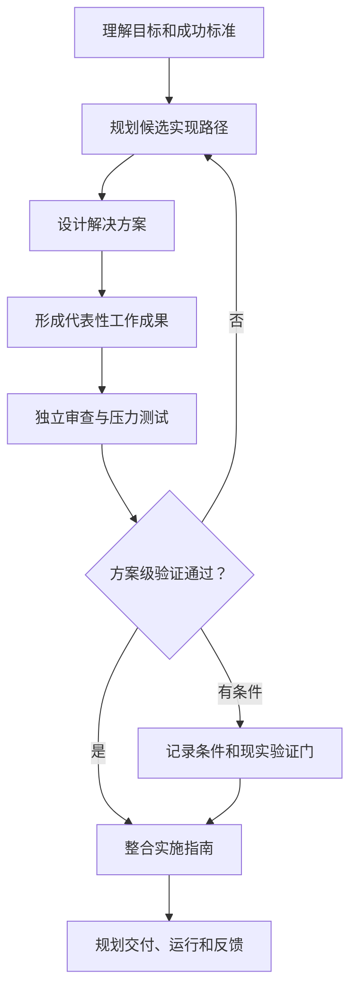
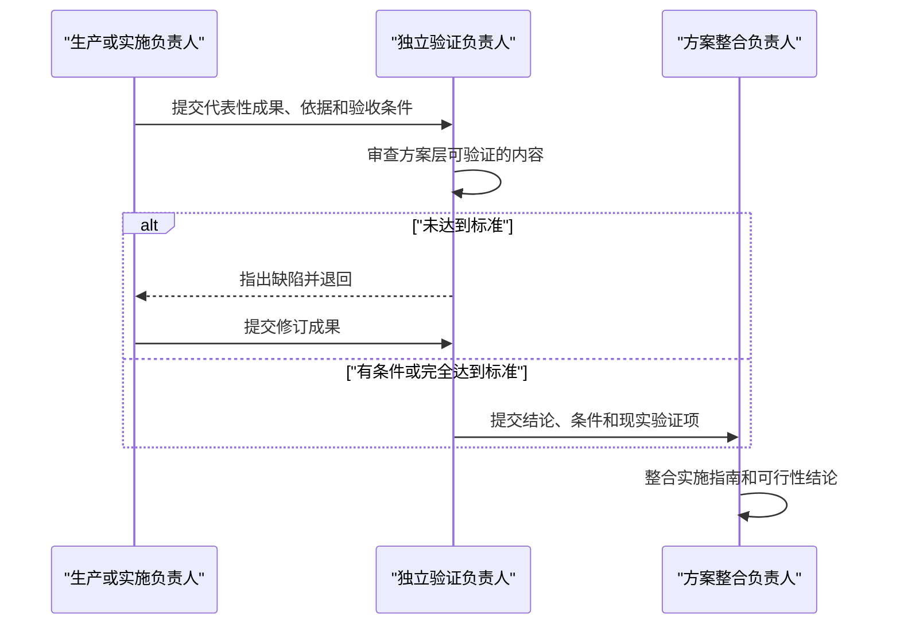

# Plan Simulation and Feasibility Protocol

Use this protocol for “目标实现推演.” Simulate the complete applicable organization and enough representative work to develop, challenge, and refine a reality-ready implementation guide without changing the real world.

## Contents

1. [Meaning and boundary](#meaning-and-boundary)
2. [Simulation method versus real execution](#simulation-method-versus-real-execution)
3. [Required initial state](#required-initial-state)
4. [State model](#state-model)
5. [Lifecycle simulation](#lifecycle-simulation)
6. [Event and artifact procedure](#event-and-artifact-procedure)
7. [Handoff and rejection protocol](#handoff-and-rejection-protocol)
8. [Plan-level feasibility validation](#plan-level-feasibility-validation)
9. [Conflict and replanning](#conflict-and-replanning)
10. [Scenario rules](#scenario-rules)
11. [Stop conditions](#stop-conditions)
12. [Failure modes](#failure-modes)
13. [Final integrity audit](#final-integrity-audit)

## Meaning and boundary

Begin the visible answer with a localized statement equivalent to:

> 以下方案通过模拟协作和方案级验证形成，可作为现实实施指南；尚未执行任何现实操作，标注的现实验证事项仍需完成。

The central model is:

- **Method:** simulated organizational collaboration, representative domain work, review, rejection, revision, integration, and stress testing.
- **Deliverable:** an implementation guide with a plan-level feasibility verdict, owners, phases, acceptance gates, and required reality checks.
- **Boundary:** no real repository, device, person, account, organization, market, payment, deployment, or operating environment is touched.

After the one-time notice, use ordinary role titles and natural language. Do not prefix every role, activity, or artifact with “virtual” or “simulated.” Use simulation language again only when needed to protect the evidence boundary.

## Simulation method versus real execution

Allowed simulation work includes:

- Interpreting accepted inputs and defining measurable outcomes.
- Designing candidate plans, systems, products, services, content, or operating models.
- Producing specifications, pseudocode, representative samples, mock records, financial models, implementation blueprints, checklists, and runbooks.
- Reviewing those artifacts against declared criteria.
- Finding logic, interface, coverage, dependency, evidence, cost, safety, or specification defects.
- Rejecting a handoff and requesting a revision.
- Rehearsing launch, operation, incidents, measurement, and feedback under explicit assumptions.
- Integrating accepted work into a guide for later real implementation.

Forbidden real-execution claims include:

- “The developer built and ran the application.”
- “The tester verified the application on three cameras.”
- “Twenty customers preferred the workflow.”
- “The release passed notarization.”
- “The campaign increased revenue.”
- “The trading strategy achieved the simulated return in a live account.”

Replace them with accurate plan-level statements:

- “The development blueprint covers the application modules and interfaces; no build was run.”
- “The compatibility review identified specification gaps and defined the camera-file tests required before release.”
- “The workflow hypothesis remains dependent on real customer validation.”
- “The risk model is internally consistent under stated assumptions; no live or historical execution result was observed.”

Never use the boundary to omit the developer, tester, operator, writer, producer, release owner, risk owner, or other role required by the real process.

## Required initial state

Do not begin collaboration events until these exist:

1. Plain-language Goal Brief and definition of done.
2. Outcome-bearing subgoals.
3. Lifecycle applicability map for all nine canonical stages.
4. Capability map created before the roster.
5. Complete role roster satisfying capability and lifecycle coverage.
6. At least one candidate implementation path with artifacts, consumers, acceptance gates, and rejection routes.
7. Artifact registry for planned representative work products.
8. Assumption, unknown, risk, and reality-check ledgers.
9. A frontstage plan that prioritizes recommendation and usability over simulation detail.

If an applicable stage lacks a producer, validator, delivery owner, or operator, repair the organization before the first event.

## State model

Maintain:

| Collection | Contents |
|---|---|
| `goal_state` | Goal, definition of done, constraints, resources, and confidence |
| `lifecycle` | Applicability, owners, artifacts, and reality checks by stage |
| `subgoals` | Dependencies, guide phases, and status |
| `capabilities` | Need, owner, stage, depth, limit, and evidence requirement |
| `roles` | Role contracts, contribution modes, and activation state |
| `artifacts` | Planned, drafted, accepted, conditionally accepted, rejected, revised, or superseded work |
| `assumptions` | Material assumptions and dependent conclusions |
| `unknowns` | Missing evidence, impact, and validation method |
| `risks` | Trigger, impact, owner, mitigation, and stop condition |
| `decisions` | Options, criteria, owner, branch, and evidence |
| `events` | Ordered material state changes |
| `feasibility_assessment` | Dimensions, findings, conditions, blockers, and status |
| `implementation_guide` | Recommended path, phases, owners, gates, and first actions |
| `reality_checks_required` | Questions that only real evidence can resolve |

Change state only through a logged event. Preserve rejected and superseded records.

## Lifecycle simulation

Represent all applicable stages, merging adjacent stages only when responsibilities remain visible:

### Round 1 — Understand, plan, and design

- Clarify outcomes, constraints, resources, horizon, and acceptance criteria.
- Produce the minimum design artifacts needed before judging implementation.
- Challenge consequential assumptions early.
- Do not allow design roles to stand in for production roles.

### Round 2 — Make the implementation concrete

- Activate implementers, makers, writers, operators, or other domain producers.
- Create representative work products sufficient to expose interfaces, dependencies, resource needs, failure paths, and quality criteria.
- Record unresolved dependencies and reality checks.
- Mark generated artifacts `created_in_simulation: true`.
- Do not fabricate a finished product when a blueprint, sample, specification, prototype plan, or runbook is the honest output.

### Round 3 — Validate and stress-test

- Transfer critical work products to declared validators.
- Apply criteria fixed before review.
- Check internal coherence, feasibility dimensions, failure paths, and testability.
- Separate plan-level findings from tests requiring real execution.
- Accept, conditionally accept, or reject.

### Round 4 — Revise and integrate

- Return defects to the accountable producer.
- Preserve rejected versions.
- Revise the smallest affected artifact or branch the implementation path.
- Reconcile accepted components, terminology, interfaces, constraints, resources, and failure behavior.

### Round 5 — Judge feasibility

- Evaluate all applicable feasibility dimensions.
- Assign `plan-viable`, `conditionally-viable`, or `not-yet-viable`.
- Link every condition and blocker to evidence, an owner, and a reality check or redesign action.
- Never force a passing status merely to satisfy the original goal.

### Round 6 — Assemble the implementation guide

- Convert accepted work into phases, owners, prerequisites, proposed actions, outputs, acceptance gates, fallback routes, and stop conditions.
- Plan delivery, adoption, operation, maintenance, measurement, and improvement where applicable.
- Identify the user's next decisions and first practical actions.
- Keep the visible summary concise even when the backstage simulation is detailed.

For simple goals, combine rounds without removing an applicable responsibility. For complex goals, add targeted iterations while preserving the two-redesign-cycle limit.

## Event and artifact procedure

For every material event:

1. Select one accountable active role.
2. Confirm lifecycle stage, contribution mode, activation conditions, and decision rights.
3. List consumed artifacts, assumptions, and unknowns.
4. Perform one bounded `simulation_action`.
5. Produce, review, reject, revise, integrate, or hand off an artifact.
6. Record evidence class and reality checks not performed.
7. Update state without erasing history.
8. State whether the consequence changes the candidate path, feasibility verdict, or guide.
9. Translate only the meaningful consequence into user-friendly prose.

Prefer:

> “质量负责人发现导出流程没有定义损坏文件的处理方式，因此将实现蓝图退回开发负责人修改。”

Avoid:

> “EV8 caused ART5 to transition to rejected.”

Keep the second representation backstage when traceability is useful.

## Handoff and rejection protocol

Use this flow:

For every handoff:

1. **Offer:** Producer names the artifact, evidence, and unperformed reality checks.
2. **Intake:** Consumer confirms completeness and authority.
3. **Review:** Validator applies predeclared criteria.
4. **Disposition:** Accept, conditionally accept, or reject.
5. **Route:** Continue, revise, branch, escalate, or stop.

A conditional acceptance must name the unresolved condition and prevent it from becoming a fact downstream.

## Plan-level feasibility validation

### What the simulation can validate

- Goal, requirement, lifecycle, and guide coverage.
- Internal logic, arithmetic, and assumption consistency.
- Technical or method plausibility at the specification level.
- Interface and dependency compatibility at the design level.
- Resource categories, cost model structure, and sensitivity to assumptions.
- Sequencing, critical dependencies, decision gates, and schedule logic.
- Operating ownership, failure handling, and recovery design.
- Error-path, edge-case, safety, and quality-control completeness.
- Traceability to accepted inputs.
- Whether planned real tests can answer the remaining questions.

### What requires real validation

- Compilation, runtime behavior, crashes, memory, latency, or benchmarks.
- Hardware, operating-system, file-format, broker, exchange, device, or platform compatibility.
- User preference, usability, willingness to pay, demand, or adoption.
- Supplier capacity, staff performance, service quality, or operational results.
- Legal advice, approval, certification, signing, notarization, or store review.
- Revenue, return, loss, cost, schedule, quality, or performance observed in reality.

The validator still exists when decisive tests require reality. Its deliverable becomes the test design, evidence requirement, sample or environment, acceptance threshold, failure route, and stop/go logic.

### Feasibility statuses

Assign exactly one:

- **`plan-viable` / 方案级可行:** All applicable plan-level gates pass; no known unresolved blocker remains under stated facts and assumptions; required reality checks are explicit.
- **`conditionally-viable` / 有条件可行:** The path is coherent, but one or more decisive assumptions, approvals, resources, integrations, or tests are unresolved.
- **`not-yet-viable` / 暂不具备可行性:** A known blocker, contradiction, unacceptable risk, or missing critical path prevents responsible recommendation.

Never present confidence as a probability of real success. Never call a plan “proven feasible” without empirical execution evidence.

## Conflict and replanning

Route:

| Conflict | Default owner and response |
|---|---|
| Artifact defect | Producer revises against the existing criterion |
| Interface mismatch | Integrator coordinates a shared contract |
| Producer-validator disagreement | Decision owner applies the declared gate |
| Missing capability or lifecycle owner | `R0` adds or reshapes a role |
| Evidence dispute | Use the least certain defensible label |
| Goal conflict | Branch or surface the decision to the user |
| Feasibility blocker | Narrow scope, change path, add a prerequisite, or stop |
| Boundary violation | Stop the event and restate it as a plan-level action |

Trigger replanning when a stage is unowned, a primary artifact has no producer, a critical artifact lacks credible validation, a loop has no seed, assumptions conflict, resources cannot support the path, or the integrated guide cannot meet the definition of done even conditionally.

Allow at most two structural redesign cycles. Resume at the earliest affected stage.

## Scenario rules

- Give every scenario explicit assumptions.
- Show material formulas or reasoning.
- Keep units and time windows compatible.
- Prefer ranges over false precision.
- Separate controllable choices from external conditions.
- Name the evidence that would replace each assumption.
- Test a downside case and a failure-recovery case when consequences matter.
- Never make simulated time appear to have elapsed.

Scenario completion is not real-world success.

## Stop conditions

Stop as `plan-viable` only when:

- Every applicable stage is represented or explicitly deferred.
- Primary work products have producers.
- Critical products passed credible plan-level validation.
- Rejected work was revised, branched, or resolved.
- Accepted work was integrated into a usable implementation guide.
- Delivery, operation, and learning are planned where applicable.
- No known plan-level blocker remains.
- Assumptions, reality checks, risks, and stop conditions remain visible.
- Comprehension, Mermaid, lifecycle, traceability, and boundary gates pass.

Stop as `conditionally-viable` when the guide is coherent but decisive conditions remain. Stop as `not-yet-viable` when a critical input cannot be bounded, safe scope cannot be established, two redesign cycles fail, or every path misses the definition of done.

Say “the plan-level validation completed,” never “the real goal was achieved.”

## Failure modes

- **Advisory-only organization:** Architects and strategists exist, but implementers or operators do not.
- **Missing test function:** Producers approve their own critical work.
- **Orchestrator collapse:** `R0` fills every missing role.
- **Persona theater:** Dialogue replaces reviewable artifacts and decisions.
- **Phantom execution:** The result claims builds, tests, contacts, deployment, metrics, returns, or elapsed time.
- **Assumption laundering:** Repetition turns an assumption into apparent fact.
- **Feasibility inflation:** Internal consistency is described as real-world proof.
- **Simulation-first output:** The user sees a long collaboration story before the recommendation.
- **Table wall:** Processes and handoffs are hidden in dense tables.
- **Schema-first writing:** IDs dominate the visible answer.
- **Guide gap:** A verdict exists, but the user receives no phased route for acting on it.

## Final integrity audit

- [ ] The boundary notice appears once and is localized.
- [ ] The recommendation and feasibility status appear before detailed simulation history.
- [ ] The complete applicable lifecycle is represented.
- [ ] Producer, validator, integrator, delivery, and operating roles exist where needed.
- [ ] Roles use normal professional names.
- [ ] No external action or observation is claimed.
- [ ] Every material event changes an artifact, decision, path, verdict, or guide.
- [ ] Plan-level and real-world validation are distinguished.
- [ ] Rejections and revisions remain traceable.
- [ ] Complex flows use valid Mermaid.
- [ ] The implementation guide contains phases, owners, gates, risks, and first actions.
- [ ] Reality checks name methods and acceptance thresholds where possible.
- [ ] The user receives only the most important remaining decisions.
